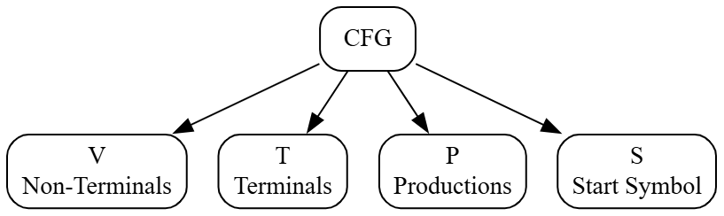
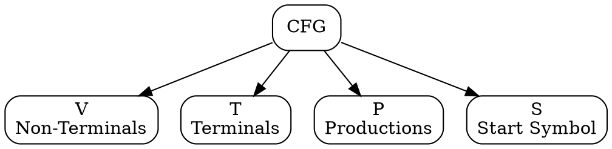
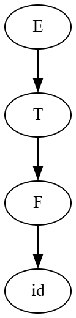
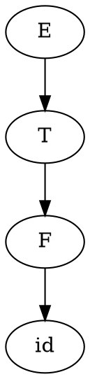
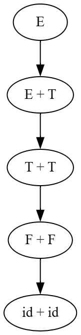
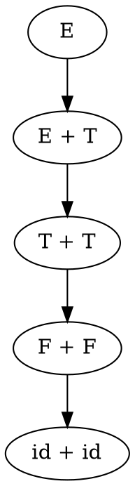

# Principles of Compiler Design
# Lecture 10 - Context-Free Grammar (CFG)

**Course:** B.Tech Information Technology (Semester VII)  
**Module:** 2 - Syntax Analysis  
**Lecture Duration:** 60 Minutes

---

# Learning Objectives

After completing this lecture, students should be able to:

- Explain what a Grammar is.
- Define Context-Free Grammar (CFG).
- Identify the four components of a CFG.
- Differentiate between terminals and non-terminals.
- Write simple production rules.

---

# Revision

In the previous lecture, we learned

```text
Characters

↓

Lexical Analyzer

↓

Tokens

↓

Syntax Analyzer

↓

Parse Tree
```

We also learned that

> **The Parser cannot work without Grammar.**

Today's question is

> **What exactly is a Grammar?**

---

# What is a Grammar?

Suppose someone asks you to write an English sentence.

You cannot randomly arrange words.

For example,

Correct sentence

```text
I am learning Compiler Design.
```

Incorrect sentence

```text
Learning I Compiler am Design.
```

Why?

Because English follows **Grammar Rules**.

Grammar defines

- what is allowed,
- what is not allowed,
- and how words should be arranged.

Programming languages also require grammar.

---

# Programming Language Grammar

Consider

```c
a = b + c;
```

This is valid.

Now consider

```c
= a + b c ;
```

Every token is valid.

But the arrangement is incorrect.

Therefore,

the compiler reports

```text
Syntax Error
```

The Parser knows this because it follows the grammar of the language.

---

# Definition of Grammar

A **Grammar** is a set of rules that specifies how valid sentences (or programs) can be formed in a language.

For English,

the rules define valid sentences.

For programming languages,

the rules define valid programs.

---

# Think Like a Compiler 💡

Imagine you are constructing a house.

You cannot place the roof first.

You must follow a **blueprint**.

```text
Blueprint

↓

Construction

↓

House
```

Similarly,

the Parser follows a **Grammar**.

```text
Grammar

↓

Parser

↓

Valid Program Structure
```

Without a grammar,

the compiler would have no idea how tokens should be combined.

---

# Formal Definition

In Compiler Design,

the grammar used by the Parser is called a

> **Context-Free Grammar (CFG).**

A CFG describes how strings of a language can be generated using a set of production rules.

---

# Why is it called "Context-Free"?

This is a common viva question.

Consider the rule

```text
A → a
```

It means

> Whenever you see the non-terminal **A**, you may replace it with **a**.

Notice that

you do **not** care where **A** appears.

Whether **A** is

```text
BA

CA

DA

EA
```

the rule

```text
A → a
```

is always applicable.

The replacement depends **only on A**,

not on the symbols before or after it.

Therefore,

the grammar is called **Context-Free**.

---

# Real-Life Analogy

Suppose a teacher says

> "Wherever you see the abbreviation **Dr.**, replace it with **Doctor**."

It doesn't matter whether it appears

```text
Dr. Sharma

Professor Dr. Sharma

Chief Dr. Sharma
```

The replacement depends only on

```text
Dr.
```

and not on its surrounding words.

This is exactly the idea of **Context-Free**.

---

# Components of a Context-Free Grammar

Every CFG consists of **four components**.

```text
CFG = (V, T, P, S)
```

Do not worry about the notation.

We will study each component one by one.

---

## Figure 10.1 : Components of a CFG



---

### Graphviz (Dreampuf) Code



Save the image as

```text
images/lec10_fig01_cfg_components.png
```

---

# CFG = (V, T, P, S)

Every Context-Free Grammar contains

| Symbol | Meaning |
|---------|----------|
| V | Set of Non-Terminals |
| T | Set of Terminals |
| P | Set of Production Rules |
| S | Start Symbol |

These four components completely define a grammar.

---

# Inside the Compiler 🔍

The Parser stores the grammar internally.

Whenever it reads tokens,

it continuously checks

```text
Grammar Rule 1

↓

Grammar Rule 2

↓

Grammar Rule 3
```

until the entire input is verified.

Without these rules,

parsing is impossible.

---

# Classroom Activity

Ask students:

Can you write a rule for forming a simple English sentence?

Expected answer:

```text
Sentence → Subject Verb Object
```

Explain that this is also a grammar rule.

Programming language grammars are written in a similar way.

---

# Summary

In this lecture, we learned:

- What is a Grammar?
- Why programming languages need grammar.
- What is a Context-Free Grammar.
- Why it is called Context-Free.
- The four components of a CFG.

---

---

# Components of a Context-Free Grammar

Recall that

```text
CFG = (V, T, P, S)
```

Every Context-Free Grammar consists of four components.

```text
V → Non-Terminals

T → Terminals

P → Production Rules

S → Start Symbol
```

Let us understand each component one by one.

---

# Running Grammar

From today onwards, we will use the following grammar throughout Module 2.

```text
E → E + T | T

T → T * F | F

F → ( E ) | id
```

This grammar is called the **Expression Grammar**.

It is one of the most widely used grammars in Compiler Design.

It can generate expressions such as

```text
a+b

a*b

a+b*c

(a+b)*c

a+b*c+d
```

---

# First Look at the Grammar

```text
E → E + T | T

T → T * F | F

F → ( E ) | id
```

Students often ask,

> "Sir, what do these letters mean?"

The answer is

```text
E → Expression

T → Term

F → Factor

id → Identifier
```

So the grammar can be read as

```text
Expression

↓

Expression + Term

or

Term
```

---

# What are Non-Terminals?

A **Non-Terminal** is a grammatical variable.

It represents a larger language construct.

A Non-Terminal can be replaced using production rules.

Examples

```text
Expression

Term

Factor
```

In our grammar,

```text
E

T

F
```

are Non-Terminals.

---

# Why are they called Non-Terminals?

Because

they are **not final symbols**.

They still need to be expanded.

For example,

```
E
```

cannot appear in the final program.

It must become

```text
E

↓

T

↓

F

↓

id
```

Only then does it become an actual program fragment.

---

# What are Terminals?

A **Terminal** is a symbol that cannot be expanded further.

These symbols actually appear in the source program.

Examples

```text
+

*

(

)

id
```

These are called Terminals because

the expansion stops here.

---

# Think Like a Compiler 💡

Suppose you are assembling a bicycle.

Initially,

you have

```text
Bicycle
```

This can be divided into

```text
Frame

Handle

Wheels
```

Each wheel can be divided into

```text
Tyre

Rim

Tube
```

Finally,

you reach actual physical parts.

You cannot divide them further.

Similarly,

Grammar expands

```
Expression

↓

Term

↓

Factor

↓

id
```

The process stops at **Terminal symbols**.

---

# Non-Terminals vs Terminals

| Non-Terminal | Terminal |
|--------------|-----------|
| Can be expanded | Cannot be expanded |
| Represents grammatical structures | Represents actual symbols |
| Appears only inside grammar | Appears in the source program |
| Example: E, T, F | Example: +, *, (, ), id |

---

# Figure 10.2 : Expansion of Non-Terminals



---

### Graphviz (Dreampuf) Code



Save the image as

```text
images/lec10_fig02_expansion.png
```

---

# Production Rules

Now consider

```text
E → E + T
```

This is called a

**Production Rule**.

A production rule tells us

how a Non-Terminal may be expanded.

The arrow

```text
→
```

can be read as

```text
can be replaced by
```

So

```text
E → T
```

means

```
Expression

can be replaced by

Term
```

Similarly,

```text
T → F
```

means

```
Term

can be replaced by

Factor
```

---

# Understanding the OR Symbol

Consider

```text
F → (E) | id
```

The symbol

```text
|
```

means

```text
OR
```

Therefore,

the rule actually represents two production rules.

```text
F → (E)

F → id
```

Similarly,

```text
E → E + T | T
```

means

```text
E → E + T

E → T
```

---

# Start Symbol

Every grammar has one special symbol

called the

**Start Symbol**.

Parsing always begins from this symbol.

In our grammar,

```text
E
```

is the Start Symbol.

The Parser starts from

```
Expression
```

and gradually derives the complete input string.

---

# Figure 10.3 : Start Symbol


---

### Graphviz (Dreampuf) Code


Save the image as

```text
images/lec10_fig03_start_symbol.png
```

---

# Complete CFG

Our grammar is now completely defined.

```text
V = {E, T, F}

T = {id, +, *, (, )}

P

E → E + T | T

T → T * F | F

F → (E) | id

S = E
```

Notice that

all four components

```text
(V, T, P, S)
```

are now identified.

---

# Classroom Activity

Ask students to identify

Non-Terminals

and

Terminals

for

```text
F → (E) | id
```

Expected answer

```text
Non-Terminals

E

F
```

```text
Terminals

(

)

id
```

---

# Common Student Mistakes

❌ Thinking that

```text
id
```

is a Non-Terminal.

It is actually a **Terminal** because it appears directly in the input program.

---

❌ Thinking

```text
+
```

can be expanded.

It cannot.

It is already a Terminal.

---

❌ Thinking

every capital letter is always a Non-Terminal.

Not necessarily.

A symbol is a Non-Terminal because the grammar defines it as one, not simply because it is uppercase.

---

# Summary

In this part, we learned:

- What are Non-Terminals.
- What are Terminals.
- What are Production Rules.
- What is the OR (`|`) operator.
- What is the Start Symbol.
- How to identify the four components of a CFG.

---

---

# How Does a Grammar Generate a Program?

Until now, we have studied

- Grammar
- Non-Terminals
- Terminals
- Production Rules
- Start Symbol

Now the next question is

> **How does the compiler use these rules to generate or recognize a program?**

The answer is

The compiler repeatedly applies **production rules**.

---

# Running Grammar

We continue using the same grammar.

```text
E → E + T | T

T → T * F | F

F → (E) | id
```

Remember

```text
E = Expression

T = Term

F = Factor

id = Identifier
```

---

# Goal

Suppose we want to generate

```text
id + id
```

How can we obtain this string from the grammar?

Start from

```text
E
```

---

## Step 1

Apply

```text
E → E + T
```

Result

```text
E + T
```

---

## Step 2

Replace the left

```text
E
```

using

```text
E → T
```

Result

```text
T + T
```

---

## Step 3

Replace both

```text
T
```

using

```text
T → F
```

Result

```text
F + F
```

---

## Step 4

Replace both

```text
F
```

using

```text
F → id
```

Result

```text
id + id
```

---

# Complete Generation

```text
E

↓

E + T

↓

T + T

↓

F + F

↓

id + id
```

This is how a grammar generates a valid expression.

---

# Figure 10.4 : Generating "id + id"



---

### Graphviz (Dreampuf) Code



Save as

```text
images/lec10_fig04_generation.png
```

---

# Another Example

Can we generate

```text
id * id
```

Yes.

Start from

```text
E
```

---

```text
E

↓

T

↓

T * F

↓

F * F

↓

id * id
```

Notice

this time we chose a different production rule.

Therefore,

different choices of production rules generate different strings.

---

# Important Observation

The grammar

does **not** generate only one expression.

It can generate

```text
id

id+id

id*id

(id)

(id+id)

(id+id)*id

id+id*id

(id+id)*(id+id)
```

and infinitely many more.

That is why we say

> **A grammar defines a language, not just a single string.**

---

# Think Like a Compiler 💡

Suppose you have LEGO blocks.

Using the same blocks,

you can build

- a car
- a house
- a bridge
- a robot

The blocks remain the same.

Only the arrangement changes.

Similarly,

using the same production rules,

the grammar can generate many valid programs.

---

# Language Generated by a Grammar

A grammar defines a set of valid strings.

This set is called a

> **Language**

For our grammar,

the language contains expressions such as

```text
id

id+id

id*id

(id)

id+id*id

(id+id)*id
```

Every valid expression belongs to the language generated by the grammar.

---

# Inside the Compiler 🔍

When the Parser receives

```text
id + id * id
```

it tries to determine

> **Can this string be generated by the grammar?**

If the answer is

```text
YES
```

the input is syntactically correct.

Otherwise,

the compiler reports

```text
Syntax Error
```

---

# Common Student Doubts

## Doubt 1

Does the grammar execute the program?

No.

It only describes how valid programs are formed.

---

## Doubt 2

Can one grammar generate many programs?

Yes.

In fact,

a grammar usually generates **an infinite number of valid strings**.

---

## Doubt 3

Can two different grammars generate the same language?

Yes.

Different grammars may describe exactly the same language.

Some grammars are simply more convenient for parsing.

---

# Classroom Activity

Ask students to generate

```text
(id)
```

using the grammar.

Expected solution

```text
E

↓

T

↓

F

↓

(E)

↓

(T)

↓

(F)

↓

(id)
```

Students will begin understanding how production rules are applied.

---

# Quick Revision

```text
Start Symbol

↓

Apply Production Rules

↓

Replace Non-Terminals

↓

Obtain Only Terminals

↓

Generated String
```

This is the basic idea behind grammar generation.

---

# Viva Questions

1. What is meant by "generation" in a grammar?
2. Can a grammar generate more than one string?
3. What is the language generated by a grammar?
4. Why do we repeatedly replace Non-Terminals?
5. When does the generation process stop?

---

# University Questions

## Two Marks

- Define the language generated by a grammar.
- What is meant by string generation?

---

## Five Marks

- Explain how a Context-Free Grammar generates strings with an example.
- Explain the concept of language generated by a CFG.

---

# End of Lecture 10

## Key Takeaways

- A grammar generates valid strings by repeatedly applying production rules.
- The generation process starts from the **Start Symbol**.
- Non-Terminals are gradually replaced until only Terminals remain.
- The collection of all valid strings generated by a grammar is called its **language**.
- The Parser checks whether an input string belongs to this language.

---

# Looking Ahead

**Lecture 11: Writing Grammars and Derivations**

We will study:

- Writing grammars for simple languages
- Leftmost Derivation
- Rightmost Derivation
- Parse Trees
- Ambiguous Grammar

These concepts are heavily asked in university examinations and form the basis of parsing algorithms.