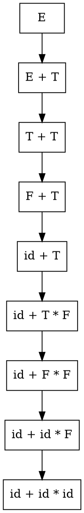
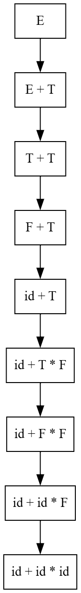
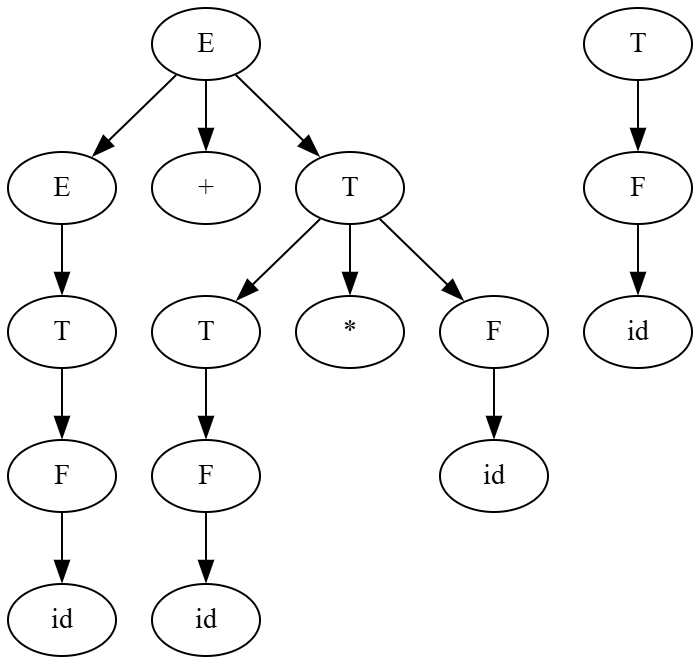
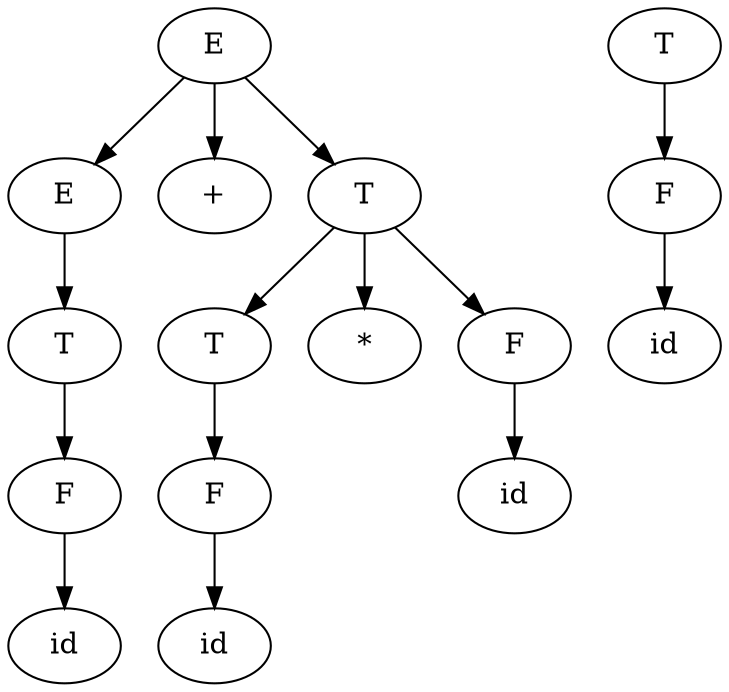
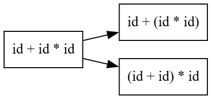
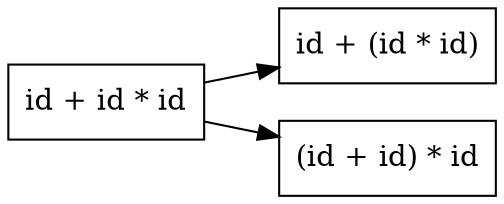

# Principles of Compiler Design
# Lecture 11 - Writing Grammars and Derivations

**Course:** B.Tech Information Technology (Semester VII)  
**Module:** 2 - Syntax Analysis

---

# Learning Objectives

After completing this lecture, students should be able to:

- Write simple Context-Free Grammars.
- Understand the concept of derivation.
- Explain why derivation is required.
- Distinguish between grammar and derivation.

---

# Revision

In the previous lecture, we learned

- Grammar
- CFG
- Non-Terminals
- Terminals
- Production Rules
- Start Symbol

We also saw that

> A Grammar can generate many valid strings.

Today's question is

> **How exactly does a grammar generate a particular string?**

The answer is

**Derivation.**

---

# What is Derivation?

A **Derivation** is the process of generating a valid string from the **Start Symbol** by repeatedly applying production rules.

Grammar tells us

> **What rules are available?**

Derivation tells us

> **Which rules are actually used?**

---

# Grammar vs Derivation

Many students confuse these two concepts.

Remember

| Grammar | Derivation |
|----------|------------|
| Set of rules | Sequence of applying those rules |
| Permanent | Depends on the input string |
| Defines a language | Generates one valid string |

Think of it like this.

A cookbook contains many recipes.

That cookbook is like the **Grammar**.

When you follow one recipe step by step,

that is the **Derivation**.

---

# Running Grammar

We continue using

```text
E → E + T | T

T → T * F | F

F → (E) | id
```

---

# Running Example

We want to generate

```text
id + id * id
```

using the grammar.

---

# Step-by-Step Derivation

Start Symbol

```text
E
```

Apply

```text
E → E + T
```

Result

```text
E + T
```

Now apply

```text
E → T
```

Result

```text
T + T
```

Apply

```text
T → F
```

Result

```text
F + T
```

Apply

```text
F → id
```

Result

```text
id + T
```

Apply

```text
T → T * F
```

Result

```text
id + T * F
```

Apply

```text
T → F
```

Result

```text
id + F * F
```

Apply

```text
F → id
```

Result

```text
id + id * F
```

Apply

```text
F → id
```

Final Result

```text
id + id * id
```

---

# Complete Derivation

```text
E

⇒ E + T

⇒ T + T

⇒ F + T

⇒ id + T

⇒ id + T * F

⇒ id + F * F

⇒ id + id * F

⇒ id + id * id
```

Notice

Every step uses **exactly one production rule**.

---

# Figure 11.1 : Derivation Process


---

### Graphviz (Dreampuf) Code



Save the image as

```text
images/lec11_fig01_derivation_process.png
```

---

# Think Like a Compiler 💡

Imagine Google Maps.

Suppose you want to travel from

```text
Navi Mumbai

↓

Pune
```

There are many possible roads.

The map contains **all roads**.

That is like the **Grammar**.

The road you actually follow

is the **Derivation**.

Grammar provides possibilities.

Derivation chooses one sequence.

---

# Inside the Compiler 🔍

The Parser performs something similar.

```text
Start Symbol

↓

Apply Rule 1

↓

Apply Rule 2

↓

Apply Rule 3

↓

...

↓

Input String Generated
```

If the required string cannot be generated,

the Parser reports a syntax error.

---

# Common Student Mistakes

❌ Grammar and Derivation are the same.

No.

Grammar is the rule book.

Derivation is one application of those rules.

---

❌ All production rules are applied.

No.

Only the required production rules are used.

---

❌ Rules can be applied randomly.

No.

Each applied rule must eventually produce the required string.

---

# Summary

In this lecture, we learned

- What is Derivation.
- Difference between Grammar and Derivation.
- How production rules are applied.
- How a valid string is generated.

---

---

# Leftmost Derivation (LMD)

Until now, we have learned that a derivation is a sequence of applying production rules.

However,

a grammar may contain **more than one Non-Terminal** at any stage.

Consider

```text
E + T
```

Both

```text
E
```

and

```text
T
```

are Non-Terminals.

Now the question is

> **Which Non-Terminal should we expand first?**

There are two possibilities.

- Expand the **leftmost** Non-Terminal.
- Expand the **rightmost** Non-Terminal.

---

# Definition

A **Leftmost Derivation (LMD)** is a derivation in which **the leftmost Non-Terminal is replaced at every step**.

Remember

> **Always choose the leftmost Non-Terminal.**

---

# Running Grammar

```text
E → E + T | T

T → T * F | F

F → (E) | id
```

---

# Example

Generate

```text
id + id * id
```

using **Leftmost Derivation**.

---

## Step 1

Start Symbol

```text
E
```

Apply

```text
E → E + T
```

Result

```text
E + T
```

---

## Step 2

Which Non-Terminal should we replace?

```text
E + T
```

The **leftmost Non-Terminal** is

```text
E
```

Apply

```text
E → T
```

Result

```text
T + T
```

---

## Step 3

Current string

```text
T + T
```

Which is the leftmost Non-Terminal?

The first

```text
T
```

Apply

```text
T → F
```

Result

```text
F + T
```

---

## Step 4

Current string

```text
F + T
```

Leftmost Non-Terminal

```text
F
```

Apply

```text
F → id
```

Result

```text
id + T
```

---

## Step 5

Current string

```text
id + T
```

Only one Non-Terminal remains.

Apply

```text
T → T * F
```

Result

```text
id + T * F
```

---

## Step 6

Current string

```text
id + T * F
```

Leftmost Non-Terminal

```text
T
```

Apply

```text
T → F
```

Result

```text
id + F * F
```

---

## Step 7

Current string

```text
id + F * F
```

Leftmost Non-Terminal

First

```text
F
```

Apply

```text
F → id
```

Result

```text
id + id * F
```

---

## Step 8

Current string

```text
id + id * F
```

Replace

```text
F
```

using

```text
F → id
```

Result

```text
id + id * id
```

---

# Complete Leftmost Derivation

```text
E

⇒ E + T

⇒ T + T

⇒ F + T

⇒ id + T

⇒ id + T * F

⇒ id + F * F

⇒ id + id * F

⇒ id + id * id
```

---

# Figure 11.2 : Leftmost Derivation



---

### Graphviz (Dreampuf) Code


Save as

```text
images/lec11_fig02_leftmost_derivation.png
```

---

# Rightmost Derivation (RMD)

Now let us solve the **same problem**.

But this time,

always replace the **rightmost Non-Terminal**.

---

# Definition

A **Rightmost Derivation (RMD)** is a derivation in which **the rightmost Non-Terminal is replaced at every step**.

Remember

> **Always choose the rightmost Non-Terminal.**

---

# Example

Generate

```text
id + id * id
```

using Rightmost Derivation.

---

```text
E

⇒ E + T

⇒ E + T * F

⇒ E + T * id

⇒ E + F * id

⇒ E + id * id

⇒ T + id * id

⇒ F + id * id

⇒ id + id * id
```

Notice

The final string is exactly the same.

Only the **order of expansion** is different.

---

# Side-by-Side Comparison

| Leftmost Derivation | Rightmost Derivation |
|---------------------|----------------------|
| Expand leftmost Non-Terminal | Expand rightmost Non-Terminal |
| Used by Top-Down Parsers | Reverse used by Bottom-Up Parsers |
| Same final string | Same final string |
| Different sequence of rule applications | Different sequence of rule applications |

---

# Think Like a Compiler 💡

Suppose you are painting a wall.

You may start

from the **left side**

or

from the **right side**.

The order changes.

The finished wall remains the same.

Similarly,

LMD and RMD use different orders,

but both generate the same valid string.

---

# Important Observation

Both derivations generate

```text
id + id * id
```

Neither derivation changes the meaning of the expression.

They only differ in **which Non-Terminal is expanded first**.

---

# Inside the Compiler 🔍

```text
Grammar

↓

Choose Expansion Order

↓

Leftmost Derivation

OR

Rightmost Derivation

↓

Same Valid String
```

---

# Common Student Mistakes

❌ Leftmost means the leftmost Terminal.

Wrong.

Always choose the **leftmost Non-Terminal**.

---

❌ Rightmost means the last character.

Wrong.

Choose the **rightmost Non-Terminal**, not the rightmost symbol.

---

❌ LMD and RMD generate different languages.

Wrong.

They generate the same language.

Only the derivation sequence changes.

---

# Classroom Activity

Ask students to identify the next symbol to expand.

```text
F + T * F
```

Question

For LMD

Which Non-Terminal should be replaced?

Answer

```text
F
```

(first one)

---

For RMD

Answer

```text
F
```

(last one)

This exercise quickly reinforces the concept.

---

# Summary

In this part, we learned

- Leftmost Derivation
- Rightmost Derivation
- Difference between LMD and RMD
- Why both generate the same string

---

---

# From Derivation to Parse Tree

In the previous part, we learned

- Leftmost Derivation
- Rightmost Derivation

Now an important question arises.

> **Do Leftmost Derivation and Rightmost Derivation produce different Parse Trees?**

The answer is

**No.**

If the grammar is **unambiguous**,

both derivations produce the **same Parse Tree**.

Only the **order of applying production rules** is different.

---

# Running Grammar

```text
E → E + T | T

T → T * F | F

F → (E) | id
```

Running Example

```text
id + id * id
```

---

# Parse Tree

## Figure 11.3 : Parse Tree for `id + id * id`



---

### Graphviz (Dreampuf) Code



Save the image as

```text
images/lec11_fig03_parse_tree.png
```

---

# Observation

Notice that

```text
id * id
```

forms one complete subtree.

Therefore,

multiplication is evaluated before addition.

The Parse Tree naturally represents

operator precedence.

---

# Important Concept

Grammar

↓

Derivation

↓

Parse Tree

Notice

A derivation describes

**how** the grammar rules are applied.

A Parse Tree describes

**the grammatical structure** of the final string.

---

# Ambiguous Grammar

Now consider another question.

> **Can one string have more than one Parse Tree?**

The answer is

**Yes.**

Such a grammar is called an

> **Ambiguous Grammar.**

---

# Definition

A grammar is called **Ambiguous**

if

**one valid string can be represented by more than one Parse Tree.**

This means

the compiler cannot determine

which interpretation is correct.

---

# Example

Consider the grammar

```text
E → E + E

E → E * E

E → id
```

Now generate

```text
id + id * id
```

---

# Interpretation 1

Suppose

multiplication is performed first.

```text
id + (id * id)
```

---

# Interpretation 2

Suppose

addition is performed first.

```text
(id + id) * id
```

Both interpretations are possible.

Therefore,

the grammar is ambiguous.

---

# Figure 11.4 : Ambiguous Grammar



---

### Graphviz (Dreampuf) Code



Save as

```text
images/lec11_fig04_ambiguous.png
```

---

# Why is Ambiguity a Problem?

Suppose the compiler receives

```text
id + id * id
```

If the grammar is ambiguous,

the compiler cannot decide

whether to compute

```text
id + (id * id)
```

or

```text
(id + id) * id
```

Different Parse Trees

↓

Different Meaning

↓

Incorrect Compilation

Therefore,

Compiler Designers always try to use

**Unambiguous Grammars.**

---

# Think Like a Compiler 💡

Suppose your friend says

```text
Let's eat Grandma.
```

and

```text
Let's eat, Grandma.
```

The words are almost identical.

But the interpretation changes completely.

Similarly,

an ambiguous grammar allows

more than one interpretation

of the same input.

---

# Inside the Compiler 🔍

```text
Input String

↓

Grammar

↓

One Parse Tree

↓

Unambiguous

OR

↓

Multiple Parse Trees

↓

Ambiguous
```

---

# Common Student Mistakes

❌ Every grammar is ambiguous.

Wrong.

Most programming language grammars are designed to be **unambiguous**.

---

❌ Ambiguity means syntax error.

Wrong.

The string is syntactically valid.

The problem is that it has **multiple valid interpretations**.

---

❌ LMD and RMD always produce different Parse Trees.

Wrong.

For an unambiguous grammar,

they produce the **same Parse Tree**.

---

# Classroom Activity

Ask students

Can the following grammar generate

two different Parse Trees?

```text
E → E + E

E → id
```

Input

```text
id + id + id
```

Discuss

```text
(id + id) + id

OR

id + (id + id)
```

This helps students visualize ambiguity.

---

# Viva Questions

1. What is a Parse Tree?
2. What is Ambiguous Grammar?
3. Why is ambiguity undesirable?
4. Can one string have multiple Parse Trees?
5. Do Leftmost and Rightmost Derivations always produce different Parse Trees?

---

# University Questions

## Two Marks

- Define Ambiguous Grammar.
- Define Parse Tree.

---

## Five Marks

- Explain Parse Tree with an example.
- Explain Ambiguous Grammar with an example.

---

## Ten Marks

- Explain Parse Tree and Ambiguous Grammar with suitable examples.
- Differentiate between Leftmost Derivation, Rightmost Derivation, and Parse Tree.

---

# End of Lecture 11

## Key Takeaways

- A **Derivation** shows the sequence of applying production rules.
- A **Parse Tree** shows the grammatical structure of the input.
- Leftmost and Rightmost Derivations differ only in the order of expansion.
- For an **unambiguous grammar**, both derivations correspond to the same Parse Tree.
- An **Ambiguous Grammar** allows more than one Parse Tree for the same input, leading to multiple interpretations.

---

# Looking Ahead

**Lecture 12: Top-Down Parsing**

We will study

- What is Parsing?
- Top-Down Parsing
- Recursive Descent Parsing
- Backtracking
- Predictive Parsing

Now that students understand **Grammar**, **Derivation**, and **Parse Trees**, they are ready to learn how a compiler actually performs parsing.