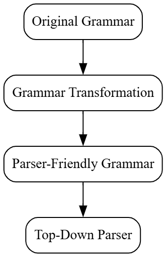
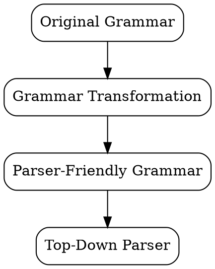
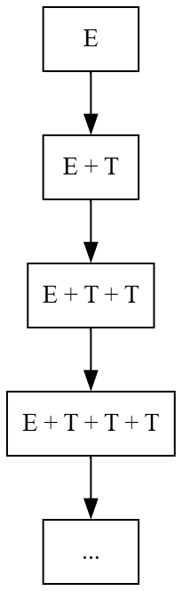
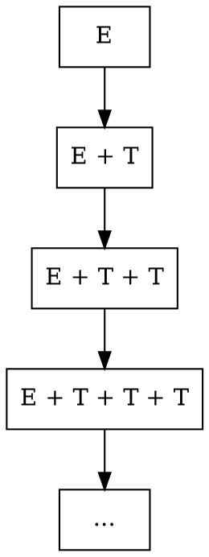
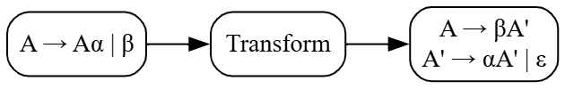
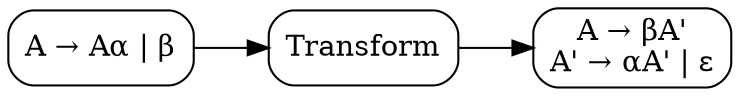
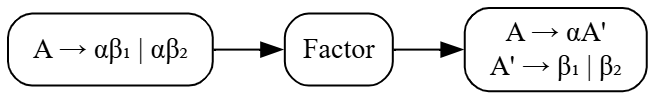
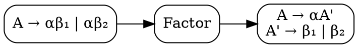

# Principles of Compiler Design
# Lecture 12 - Grammar Transformation for Top-Down Parsing (Part 1)

**Course:** B.Tech Information Technology (Semester VII)  
**Module:** 2 - Syntax Analysis  
**Duration:** 60 Minutes

---

# Learning Objectives

After completing this lecture, students should be able to:

- Explain why some grammars cannot be parsed directly.
- Define Left Recursion.
- Identify Direct Left Recursion.
- Explain why Left Recursion causes problems in Recursive Descent Parsing.
- Eliminate Direct Left Recursion from a grammar.

---

# Revision

In the previous lecture, we learned:

- Context-Free Grammar (CFG)
- Derivations
- Parse Trees
- Ambiguous Grammar

A natural question now arises.

> **Can every grammar be used directly by a parser?**

The answer is

**No.**

Some grammars must first be **transformed**.

---

# Motivation

Consider the following grammar.

```text
E → E + T | T
T → T * F | F
F → (E) | id
```

This grammar correctly describes arithmetic expressions.

It is mathematically correct.

But surprisingly,

it **cannot be used directly by a Top-Down Parser**.

Why?

Because it contains **Left Recursion**.

---

# Grammar Transformation

Before building a Top-Down Parser, we may need to modify the grammar.

The language accepted by the grammar **must remain the same**.

Only the form of the grammar changes.

```text
Original Grammar
        │
        ▼
Grammar Transformation
        │
        ▼
Parser-Friendly Grammar
        │
        ▼
Top-Down Parser
```

---

## Figure 12.1 : Grammar Transformation



---

### Graphviz (Dreampuf) Code

Paste into:

https://dreampuf.github.io/GraphvizOnline/



Save the image as

```text
images/lec12_fig01_grammar_transformation.png
```

---

# What is Left Recursion?

Look at the production rule

```text
E → E + T
```

The left-hand side is

```text
E
```

The right-hand side **also begins with E**.

Similarly,

```text
T → T * F
```

also begins with **T**.

This is called **Left Recursion**.

---

# Definition

A grammar is said to have **Direct Left Recursion** if a production is of the form

```text
A → Aα
```

where

- **A** is a Non-Terminal.
- **α (alpha)** is one or more grammar symbols.

The Non-Terminal appears again as the **leftmost symbol** on the right-hand side.

---

# Examples

### Left Recursive ✔

```text
E → E + T
```

```text
A → A a
```

```text
S → S b
```

---

### Not Left Recursive ✘

```text
E → T
```

```text
F → id
```

```text
A → bA
```

Notice in the last rule,

the right-hand side starts with **b**, not **A**.

Therefore, it is **not** Left Recursive.

---

# Think Like a Compiler 💡

Imagine searching for a book in a library.

You ask the librarian,

> "Where is the Compiler Design book?"

The librarian replies,

> "Ask the librarian."

You ask again.

Again the answer is,

> "Ask the librarian."

This continues forever.

You never reach the book.

Similarly,

the parser repeatedly expands the same Non-Terminal without making progress.

---

# Why is Left Recursion a Problem?

Suppose we begin parsing from

```text
E
```

Using the rule

```text
E → E + T
```

we get

```text
E

↓

E + T
```

Again,

the leftmost symbol is

```text
E
```

Applying the same rule repeatedly gives

```text
E

↓

E + T

↓

E + T + T

↓

E + T + T + T

↓

...
```

The parser never reaches a terminal symbol.

This results in **infinite recursion**.

---

## Figure 12.2 : Infinite Expansion



---

### Graphviz (Dreampuf) Code



Save the image as

```text
images/lec12_fig02_infinite_recursion.png
```

---

# Inside the Compiler 🔍

Suppose a Recursive Descent Parser contains the function

```c
parseE()
{
    parseE();
}
```

When `parseE()` is called,

it immediately calls itself again.

That call again calls itself.

```text
parseE()

↓

parseE()

↓

parseE()

↓

parseE()

↓

...
```

The recursion never ends.

Eventually, the program crashes due to **stack overflow**.

This is exactly what Left Recursion causes in a Top-Down Parser.

---

# Important Observation

Left Recursion is **not a grammar error**.

The grammar is perfectly valid.

The problem is that **Recursive Descent Parsers cannot process it directly**.

Therefore,

before constructing a Top-Down Parser,

we must eliminate Left Recursion.

---

# Summary

In this part, we learned:

- Why grammar transformation is needed.
- What is Direct Left Recursion.
- How to identify Left Recursive productions.
- Why Left Recursion causes infinite recursion.
- Why it must be removed before Top-Down Parsing.

---

---

# Eliminating Direct Left Recursion

In the previous section, we saw that the grammar

```text
E → E + T | T
```

causes infinite recursion in a Top-Down Parser.

The obvious question is

> **Can we rewrite this grammar without changing the language?**

The answer is

**Yes.**

We transform the grammar into an equivalent grammar that generates the **same language** but is suitable for Top-Down Parsing.

---

# General Form

Suppose a grammar has the form

```text
A → Aα | β
```

where

- **A** = Non-Terminal
- **Aα** = Left Recursive Production
- **β** = Production that does **not** begin with A

For example

```text
E → E + T | T
```

Here,

```text
A = E

α = + T

β = T
```

---

# The Idea Behind the Transformation

Let's look carefully.

Original grammar

```text
E → E + T | T
```

What is happening?

The expression always starts with

```text
T
```

and then we may have

```text
+ T

+ T

+ T

...
```

That means

```text
T

or

T + T

or

T + T + T

or

T + T + T + T

...
```

So instead of repeatedly expanding **E**, we can think of it as:

- Start with **T**
- Then repeat **+ T** zero or more times.

This observation is the key to eliminating Left Recursion.

---

# Transformation Rule

Whenever we have

```text
A → Aα | β
```

replace it with

```text
A  → βA'

A' → αA' | ε
```

where

- **A'** (A-prime) is a new Non-Terminal.
- **ε (epsilon)** means **empty string**.

This grammar generates exactly the same language but avoids Left Recursion.

---

# Why Do We Need ε?

Suppose we want to generate

```text
id
```

without any `+ id`.

Eventually, we must stop repeating.

The production

```text
A' → ε
```

allows the parser to stop.

Without ε,

the parser would be forced to keep adding more symbols forever.

---

# Example 1

Original Grammar

```text
E → E + T | T
```

Applying the rule

```text
E  → TE'

E' → +TE' | ε
```

This grammar is **not Left Recursive**.

---

# Does It Generate the Same Language?

Let's generate

```text
id + id + id
```

New Grammar

```text
E  → TE'

E' → +TE' | ε

T  → id
```

Generation

```text
E

↓

TE'

↓

idE'

↓

id + TE'

↓

id + idE'

↓

id + id + TE'

↓

id + id + idE'

↓

id + id + id
```

(using `E' → ε` in the final step)

The language remains the same.

---

# Example 2

Original Grammar

```text
A → Aa | b
```

Transformation

```text
A  → bA'

A' → aA' | ε
```

---

# Example 3

Original Grammar

```text
S → Sb | a
```

Transformation

```text
S  → aS'

S' → bS' | ε
```

---

# Figure 12.3 : Left Recursion Elimination



---

### Graphviz (Dreampuf) Code



Save the image as

```text
images/lec12_fig03_left_recursion_elimination.png
```

---

# Think Like a Compiler 💡

Imagine climbing a staircase.

Instead of saying

```text
Go back to the first step,
then climb.
```

we say

```text
Start at the first step.

Continue climbing if needed.

Stop whenever you want.
```

This avoids repeatedly returning to the beginning.

Similarly,

the transformed grammar

starts with **β**,

then repeatedly applies **α**,

and finally stops using **ε**.

---

# Common Student Mistakes

❌ Forgetting to introduce the new Non-Terminal (`A'`).

Every transformation requires a new Non-Terminal.

---

❌ Forgetting the ε production.

Without ε,

the repetition never ends.

---

❌ Changing the language.

The transformed grammar **must generate exactly the same language** as the original grammar.

---

# Classroom Activity

Transform the following grammar.

```text
A → Ac | d
```

Expected Answer

```text
A  → dA'

A' → cA' | ε
```

Now ask students to generate

```text
dcc
```

using the transformed grammar.

This helps them see that the language has not changed.

---

# Summary

In this part, we learned:

- The general form of Direct Left Recursion.
- The transformation rule.
- Why a new Non-Terminal is introduced.
- The purpose of ε.
- How to eliminate Direct Left Recursion while preserving the language.

---

---

# Left Factoring

So far, we have learned how to eliminate **Left Recursion**.

Now let us study another important grammar transformation called

> **Left Factoring**

---

# Motivation

Consider the following grammar.

```text
S → if E then S
S → if E then S else S
```

Look carefully.

Both productions begin with

```text
if E then S
```

Suppose the parser reads

```text
if E then S
```

Can it immediately decide

which production to use?

**No.**

Because both productions begin with exactly the same symbols.

The parser must read more input before making a decision.

This situation is called the **common prefix problem**.

---

# Think Like a Compiler 💡

Imagine you are using Google Maps.

You reach a road.

```
                Start
                  │
                  │
            Same Road
                  │
        ┌─────────┴─────────┐
        │                   │
     School             Railway Station
```

Initially,

both destinations share the same road.

Only after travelling some distance

can you decide which direction to take.

Similarly,

the parser cannot decide immediately because

multiple productions start with the same prefix.

---

# Definition

**Left Factoring** is the process of rewriting a grammar so that productions with a common prefix are grouped together.

This helps the parser make decisions without backtracking.

---

# General Form

Suppose a grammar has the form

```text
A → αβ₁ | αβ₂
```

Both productions begin with

```text
α
```

We rewrite it as

```text
A  → αA'

A' → β₁ | β₂
```

Notice

The common prefix

```text
α
```

is written only once.

---

# Example 1

Original Grammar

```text
S → if E then S
S → if E then S else S
```

Common Prefix

```text
if E then S
```

Factored Grammar

```text
S  → if E then SS'

S' → else S | ε
```

Now,

the parser reads

```text
if E then S
```

After that,

it simply checks whether

```text
else
```

is present.

If yes,

use

```text
else S
```

Otherwise,

choose

```text
ε
```

---

# Example 2

Original Grammar

```text
A → abc
A → abd
```

Common Prefix

```text
ab
```

Factored Grammar

```text
A  → abA'

A' → c | d
```

---

# Example 3

Original Grammar

```text
B → int id
B → int num
```

Factored Grammar

```text
B  → int B'

B' → id | num
```

---

# Figure 12.4 : Left Factoring



---

### Graphviz (Dreampuf) Code



Save the image as

```text
images/lec12_fig04_left_factoring.png
```

---

# Left Recursion vs Left Factoring

Students often confuse these two concepts.

| Left Recursion | Left Factoring |
|----------------|----------------|
| Problem: Production starts with the same Non-Terminal. | Problem: Multiple productions share the same prefix. |
| Causes infinite recursion. | Causes difficulty in choosing a production. |
| Solved by removing recursion. | Solved by extracting the common prefix. |
| Example: `E → E + T` | Example: `S → if E then S \| if E then S else S` |

Remember

- **Left Recursion** → Parser keeps calling itself.
- **Left Factoring** → Parser cannot decide which rule to choose.

---

# Inside the Compiler 🔍

When a Predictive Parser reads the next token,

it wants to choose **exactly one production**.

Without Left Factoring,

the parser sees

```text
if ...
```

and finds two matching productions.

It cannot decide immediately.

After Left Factoring,

there is only one production starting with

```text
if
```

The decision becomes straightforward.

---

# Common Student Mistakes

❌ Left Factoring changes the language.

Wrong.

Only the grammar is rewritten.

The language remains exactly the same.

---

❌ Left Factoring removes recursion.

Wrong.

Left Factoring solves the **common prefix** problem.

It does **not** remove Left Recursion.

---

❌ Every grammar requires Left Factoring.

Wrong.

Only grammars with common prefixes need Left Factoring.

---

# Classroom Activity

Perform Left Factoring on

```text
A → aBC
A → aDE
```

Expected Answer

```text
A  → aA'

A' → BC | DE
```

Now ask

"What was the common prefix?"

Expected answer

```text
a
```

---

# Quick Revision

Before Top-Down Parsing,

the grammar should ideally satisfy:

✔ No Left Recursion

✔ No Common Prefix

This makes the grammar suitable for Recursive Descent and Predictive Parsing.

---

# Viva Questions

1. What is Left Factoring?
2. Why is Left Factoring required?
3. Does Left Factoring change the language?
4. Differentiate between Left Recursion and Left Factoring.
5. What is a common prefix?

---

# University Questions

## Two Marks

- Define Left Factoring.
- Why is Left Factoring required?

---

## Five Marks

- Eliminate Left Recursion from a grammar.
- Perform Left Factoring on a given grammar.

---

## Ten Marks

- Explain Grammar Transformation with suitable examples.
- Compare Left Recursion and Left Factoring.

---

# End of Lecture 12

## Key Takeaways

- Not every grammar is directly suitable for Top-Down Parsing.
- **Left Recursion** causes infinite recursion in Recursive Descent Parsers.
- Direct Left Recursion can be eliminated by introducing a new Non-Terminal and using **ε**.
- **Left Factoring** removes common prefixes so that the parser can make deterministic decisions.
- Both transformations preserve the language but make the grammar suitable for Top-Down Parsing.

---

# Looking Ahead

**Lecture 13: Top-Down Parsing and Recursive Descent Parsing**

We will study:

- What is Parsing?
- Top-Down Parsing
- Recursive Descent Parser
- Recursive Descent Algorithm
- Backtracking
- Advantages and Limitations