# Principles of Compiler Design
# Lecture 13 - Top-Down Parsing and Recursive Descent Parsing (Part 1)

**Course:** B.Tech Information Technology (Semester VII)
**Module:** 2 - Syntax Analysis
**Duration:** 60 Minutes

---

# Learning Objectives

After completing this lecture, students should be able to:

- Explain what parsing is.
- Describe the purpose of a parser.
- Differentiate between Top-Down and Bottom-Up parsing.
- Explain the working principle of Top-Down Parsing.
- Understand why Top-Down Parsing starts from the Start Symbol.

---

# Revision

In the previous lecture, we learned that not every grammar is suitable for parsing.

Before building a Top-Down Parser, we may need to

- Eliminate Left Recursion
- Perform Left Factoring

Now that our grammar is parser-friendly,

we can finally learn

> **How does a parser actually work?**

---

# Motivation

Suppose the compiler receives the following input.

```text
a + b * c
```

The Lexical Analyzer converts it into tokens.

```text
id + id * id
```

Now the parser receives these tokens.

How does it determine whether this sequence follows the grammar?

This process is called

# Parsing

---

# What is Parsing?

Parsing is the process of checking whether the sequence of input tokens follows the grammar of the language.

If the input follows the grammar,

the parser builds a **Parse Tree**.

Otherwise,

it reports a **Syntax Error**.

---

# Definition

**Parsing** is the process of analyzing a sequence of tokens according to the production rules of a Context-Free Grammar (CFG).

Input

```text
id + id * id
```

↓

Parser

↓

Parse Tree

↓

Syntax Correct

---

# Why is Parsing Required?

The parser performs three important tasks.

1. Checks whether the program follows the grammar.
2. Builds the Parse Tree.
3. Detects syntax errors before code generation.

Without parsing,

the compiler cannot understand the structure of the program.

---

# Position of Parser in Compiler

```text
Source Program

↓

Lexical Analyzer

↓

Tokens

↓

Parser

↓

Parse Tree

↓

Semantic Analyzer
```

---

## Figure 13.1 : Position of Parser

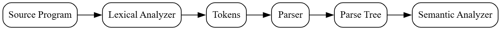

---

### Graphviz (Dreampuf) Code

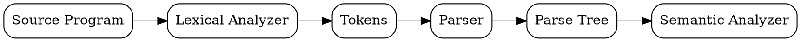

Save the image as

```text
images/lec13_fig01_parser_position.png
```

---

# Types of Parsing

There are two major approaches.

```text
                Parsing
                   │
         ┌─────────┴─────────┐
         │                   │
 Top-Down Parsing     Bottom-Up Parsing
```

---

## Figure 13.2 : Types of Parsing

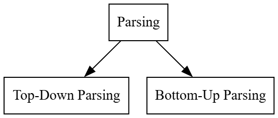

---

### Graphviz (Dreampuf) Code

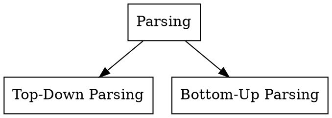

Save the image as

```text
images/lec13_fig02_types_of_parsing.png
```

---

# Top-Down Parsing

Top-Down Parsing begins with the **Start Symbol** of the grammar.

The parser repeatedly applies production rules to derive the input string.

The construction of the Parse Tree starts from the **root** and proceeds towards the **leaf nodes**.

Therefore,

it is called **Top-Down Parsing**.

---

# Working Principle

Suppose the grammar is

```text
S → aA

A → b
```

Input

```text
ab
```

The parser starts with

```text
S
```

Apply

```text
S → aA
```

Result

```text
aA
```

Next,

apply

```text
A → b
```

Result

```text
ab
```

The generated string matches the input.

Therefore,

the input is accepted.

---

# Figure 13.3 : Top-Down Parsing

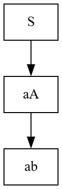

---

### Graphviz (Dreampuf) Code

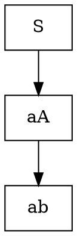

Save the image as

```text
images/lec13_fig03_top_down_parsing.png
```

---

# Think Like a Compiler 💡

Imagine constructing a family tree.

You begin with the **grandparents** at the top.

Then add the **parents**.

Finally, add the **children**.

You move from the top towards the bottom.

Similarly,

Top-Down Parsing starts from the **Start Symbol (root)** and gradually expands until all **Terminal symbols (leaves)** are produced.

---

# Top-Down vs Bottom-Up

| Top-Down Parsing | Bottom-Up Parsing |
|------------------|-------------------|
| Starts from Start Symbol | Starts from Input String |
| Builds Parse Tree from Root to Leaves | Builds Parse Tree from Leaves to Root |
| Uses Leftmost Derivation | Uses Reverse of Rightmost Derivation |
| Simpler to understand | More powerful and widely used in compilers |

**Note:** We will study Bottom-Up Parsing in the next module.

---

# Inside the Compiler 🔍

When the parser receives tokens,

it repeatedly performs two actions.

1. Select a production rule.
2. Expand the current Non-Terminal.

This continues until

- the generated string matches the input (success), or
- no valid production exists (syntax error).

---

# Common Student Mistakes

❌ Parsing and Lexical Analysis are the same.

Wrong.

Lexical Analysis produces **tokens**.

Parsing checks the **grammar** of those tokens.

---

❌ Top-Down Parsing starts from the input string.

Wrong.

It always starts from the **Start Symbol**.

---

❌ Parser checks variable values.

Wrong.

The parser checks only **syntax**, not semantics.

---

# Classroom Activity

Grammar

```text
S → aA

A → b
```

Input

```text
ab
```

Ask students to derive the string step by step from the Start Symbol.

Then ask:

> "Would the parser accept the input `aa`?"

Students quickly see that no production can replace `A` with `a`, so the parser reports a syntax error.

---

# Summary

In this lecture, we learned:

- What is Parsing?
- Why Parsing is required.
- Position of the Parser in a compiler.
- Types of Parsing.
- Working principle of Top-Down Parsing.

---

---

# Recursive Descent Parsing

We have learned that a **Top-Down Parser** starts from the **Start Symbol** and tries to derive the input string.

One of the simplest ways to implement a Top-Down Parser is called

> **Recursive Descent Parsing (RDP).**

---

# What is Recursive Descent Parsing?

A **Recursive Descent Parser** is a Top-Down Parser in which **each Non-Terminal is implemented as a separate recursive function**.

Each function is responsible for recognizing the grammar corresponding to that Non-Terminal.

For example,

Grammar

```text
S → aA

A → b
```

can be implemented as two functions.

```text
parseS()

parseA()
```

---

# Why is it called "Recursive"?

Consider the grammar

```text
S → aA
```

The parser starts by calling

```text
parseS()
```

Inside `parseS()`,

the parser recognizes

```text
a
```

and then calls

```text
parseA()
```

because the production contains the Non-Terminal **A**.

Whenever one parsing function calls another parsing function,

the implementation naturally becomes **recursive**.

---

# Mapping Grammar to Functions

Grammar

```text
S → aA

A → b
```

Function Mapping

| Grammar Symbol | Function |
|---------------|----------|
| S | parseS() |
| A | parseA() |

Rule

> **One Non-Terminal = One Parsing Function**

---

# Example

Input

```text
ab
```

Grammar

```text
S → aA

A → b
```

Execution

```text
parseS()

↓

match('a')

↓

parseA()

↓

match('b')

↓

Success
```

The parser reaches the end of the input.

Hence,

the string is accepted.

---

# Figure 13.4 : Recursive Descent Parsing

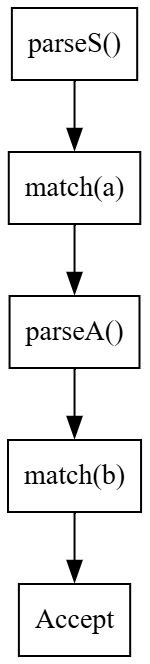

---

### Graphviz (Dreampuf) Code

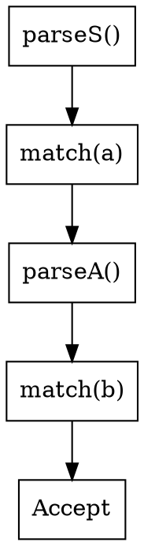

Save as

```text
images/lec13_fig04_recursive_descent.png
```

---

# Recursive Descent Parser (Pseudo-code)

Grammar

```text
S → aA

A → b
```

Pseudo-code

```text
parseS()
{
    match('a');
    parseA();
}

parseA()
{
    match('b');
}
```

Notice

There is one function for every Non-Terminal.

---

# What is match()?

The function

```text
match(x)
```

checks whether the current input symbol is

```text
x
```

If yes,

the parser moves to the next input symbol.

Otherwise,

a syntax error is reported.

Example

Input

```text
ab
```

Current symbol

```text
a
```

Statement

```text
match('a')
```

Result

✔ Success

Pointer moves to

```text
b
```

---

# Think Like a Compiler 💡

Imagine assembling furniture.

Each instruction booklet contains smaller tasks.

```
Assemble Table

↓

Assemble Legs

↓

Assemble Screws

↓

Done
```

Each task may call another smaller task.

Similarly,

each parsing function calls another parsing function whenever it encounters a Non-Terminal.

---

# Advantages of Recursive Descent Parsing

- Simple to understand.
- Easy to implement.
- Directly follows the grammar.
- Useful for small languages and educational compilers.

---

# Limitation

A Recursive Descent Parser **cannot handle Left Recursive Grammars**.

That is why we studied

- Left Recursion Removal
- Left Factoring

in the previous lecture.

---

# Common Student Mistakes

❌ One function for each production.

Wrong.

The parser generally uses **one function for each Non-Terminal**.

---

❌ Recursive Descent works for every grammar.

Wrong.

The grammar should be free from Left Recursion and should preferably be Left Factored.

---

# Summary

In this part, we learned

- Recursive Descent Parsing
- Mapping grammar to recursive functions
- Working of `match()`
- Advantages and limitations

---

---

# Backtracking in Recursive Descent Parsing

In the previous part, we learned that a Recursive Descent Parser uses recursive functions to recognize grammar productions.

But what happens when a grammar has **multiple productions** for the same Non-Terminal?

Consider the grammar

```text
S → aA

S → aB

A → b

B → c
```

Suppose the input is

```text
ac
```

The parser starts with

```text
parseS()
```

Both productions begin with

```text
a
```

The parser cannot immediately decide which production to use.

---

# What Happens?

Suppose the parser chooses

```text
S → aA
```

The parser successfully matches

```text
a
```

Next, it expects

```text
b
```

But the actual input is

```text
c
```

The parser realizes that its earlier choice was incorrect.

So it must return to the previous decision point and try another production.

This process is called

# Backtracking

---

# Definition

**Backtracking** is the process of returning to a previous decision point and trying another production rule when the current choice fails.

---

# Example

Grammar

```text
S → aA

S → aB

A → b

B → c
```

Input

```text
ac
```

Execution

```text
parseS()

↓

Choose S → aA

↓

match(a)

↓

parseA()

↓

Expected b

↓

Found c

↓

Failure

↓

Backtrack

↓

Choose S → aB

↓

match(a)

↓

parseB()

↓

match(c)

↓

Success
```

---

## Figure 13.5 : Backtracking

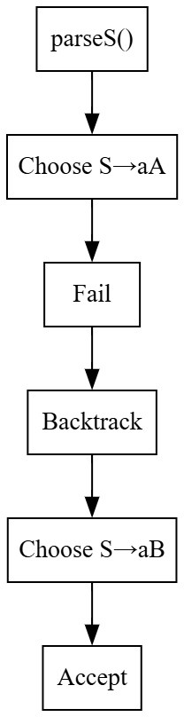

---

### Graphviz (Dreampuf) Code

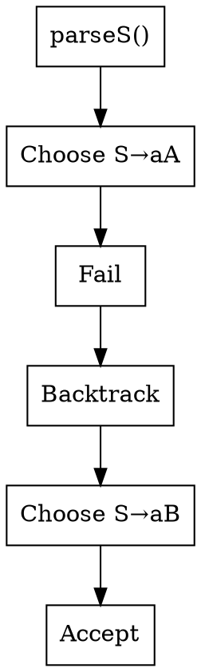

Save the image as

```text
images/lec13_fig05_backtracking.png
```

---

# Why is Backtracking Bad?

Backtracking has several disadvantages.

- The parser may repeat the same work.
- Parsing becomes slower.
- The implementation becomes more complicated.
- Large programs become inefficient to parse.

Compiler designers prefer parsers that **do not backtrack**.

---

# Think Like a Compiler 💡

Imagine driving to a destination.

You take a road.

After travelling 10 km,

you discover it is the wrong road.

Now you must return 10 km and choose another route.

This wastes both time and fuel.

Similarly,

Backtracking wastes computation by exploring incorrect productions.

---

# The Solution

Instead of making random choices,

what if the parser could decide

the correct production

by looking at the **next input symbol**?

For example,

Grammar

```text
S → aA

S → bB
```

If the next input symbol is

```text
a
```

the parser immediately selects

```text
S → aA
```

No backtracking is required.

---

# Predictive Parsing

A parser that selects the correct production

by looking at the upcoming input symbol

is called a

> **Predictive Parser**

It predicts the correct production

before expanding the grammar.

This makes parsing

- Faster
- Simpler
- Deterministic

---

# How Does the Parser Predict?

The obvious question is

> **How does the parser know which production to choose?**

The answer is

It uses two important concepts.

- **FIRST Set**
- **FOLLOW Set**

These sets help the parser construct an **LL(1) Parsing Table**, allowing it to select the correct production without backtracking.

---

# Roadmap

Our journey so far

```text
Grammar

↓

Left Recursion Removal

↓

Left Factoring

↓

Recursive Descent Parsing

↓

Backtracking Problem

↓

FIRST Set

↓

FOLLOW Set

↓

LL(1) Parsing Table

↓

Predictive Parser
```

---

## Figure 13.6 : Evolution of Top-Down Parsing

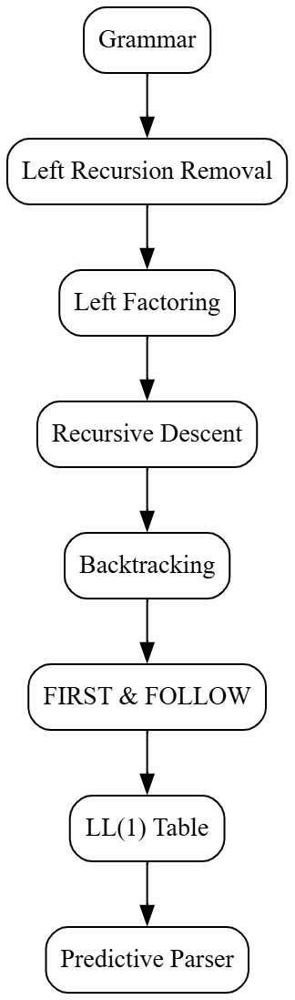

---

### Graphviz (Dreampuf) Code

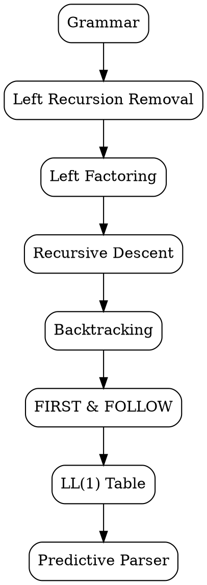

Save the image as

```text
images/lec13_fig06_parser_evolution.png
```

---

# Common Student Mistakes

❌ Backtracking means going backwards in the input string.

Wrong.

The parser goes back to a **previous decision point**, not necessarily to the beginning of the input.

---

❌ Every Recursive Descent Parser performs Backtracking.

Wrong.

A **Predictive Recursive Descent Parser** avoids backtracking by using FIRST and FOLLOW information.

---

❌ FIRST and FOLLOW are parsing algorithms.

Wrong.

They are **sets** used to build an LL(1) Parsing Table.

---

# Viva Questions

1. What is Backtracking?
2. Why is Backtracking undesirable?
3. What is Predictive Parsing?
4. Why do we need FIRST and FOLLOW sets?
5. How does a Predictive Parser differ from a basic Recursive Descent Parser?

---

# University Questions

## Two Marks

- Define Backtracking.
- Define Predictive Parsing.

---

## Five Marks

- Explain Backtracking with an example.
- Explain the need for Predictive Parsing.

---

## Ten Marks

- Explain Recursive Descent Parsing and discuss the problem of Backtracking.
- Explain the evolution from Recursive Descent Parsing to Predictive Parsing.

---

# End of Lecture 13

## Key Takeaways

- Recursive Descent Parsing is simple but may require **Backtracking**.
- Backtracking increases parsing time and complexity.
- Predictive Parsing avoids backtracking by choosing productions intelligently.
- **FIRST** and **FOLLOW** sets provide the information needed to make those choices.
- This leads to the construction of an **LL(1) Parser**, one of the most widely taught Top-Down parsing techniques.

---

# Looking Ahead

**Lecture 14: FIRST and FOLLOW Sets**

We will learn:

- What is FIRST?
- Rules for computing FIRST
- What is FOLLOW?
- Rules for computing FOLLOW
- Worked examples using the same grammar throughout the lecture