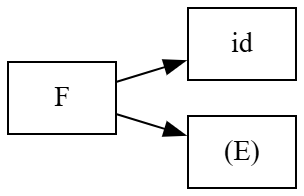
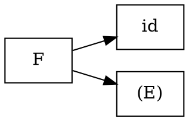
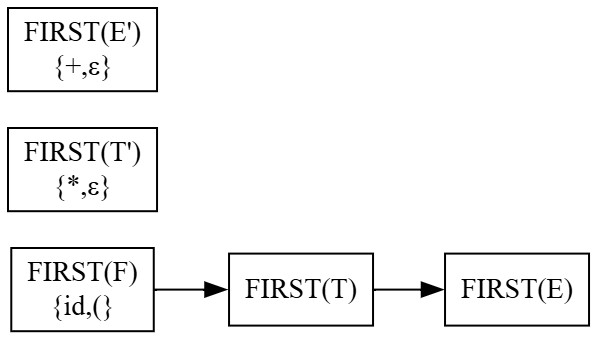
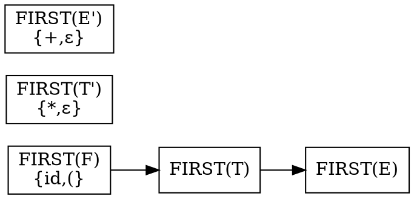
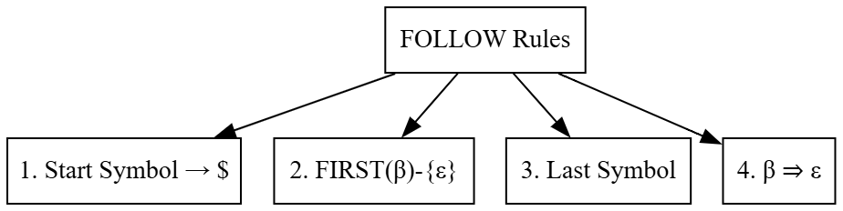
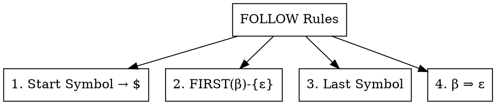

# Principles of Compiler Design
# Lecture 14 - FIRST and FOLLOW Sets

**Course:** B.Tech Information Technology (Semester VII)
**Module:** 2 - Syntax Analysis
**Duration:** 60 Minutes

---

# Learning Objectives

After completing this lecture, students should be able to:

- Explain why the FIRST set is needed.
- Define the FIRST set.
- Compute the FIRST set for terminals and non-terminals.
- Apply the rules for finding FIRST.
- Understand the role of ε (epsilon) in FIRST sets.

---

# Revision

In the previous lecture, we learned:

- Recursive Descent Parsing
- Backtracking
- Predictive Parsing

We also discovered an important problem.

A parser often has **multiple productions** to choose from.

For example,

```text
A → aB

A → bC
```

When the parser sees the next input symbol,

it must decide

> **Which production should I use?**

How can the parser make this decision?

---

# Motivation

Consider the grammar

```text
A → aB

A → bC
```

Suppose the next input symbol is

```text
a
```

Which production should the parser choose?

Obviously,

```text
A → aB
```

Now suppose the next input symbol is

```text
b
```

The parser should choose

```text
A → bC
```

Notice something interesting.

The parser only looked at the **first symbol** of each production.

This observation leads to the concept of the **FIRST Set**.

---

# Think Like a Compiler 💡

Imagine you are choosing the correct bus.

Three buses are waiting.

```
Bus 1 → Pune

Bus 2 → Nashik

Bus 3 → Goa
```

You don't need to inspect the entire journey.

You only read the **destination written at the front**.

Similarly,

the parser only wants to know

> **What is the first terminal that can appear?**

It doesn't care about the rest of the production yet.

---

# What is FIRST?

The **FIRST** set tells us

> **Which terminal symbol can appear first when a grammar symbol is expanded?**

In simple words,

FIRST answers the question

> **"What can I see first?"**

---

# Formal Definition

The **FIRST(X)** of a grammar symbol **X** is the set of terminal symbols that can appear as the **first symbol** in any string derived from **X**.

If **X** can derive the empty string,

then **ε** is also included in FIRST(X).

---

# Running Grammar

We will use the same grammar for the next three lectures.

```text
E  → T E'

E' → + T E' | ε

T  → F T'

T' → * F T' | ε

F  → id | (E)
```

Remember this grammar.

We will use it for

- FIRST
- FOLLOW
- LL(1) Table
- Predictive Parsing

---

# Rule 1

## FIRST of a Terminal

The FIRST of a terminal is the terminal itself.

Examples

```text
FIRST(id)

=

{ id }
```

```text
FIRST(+)

=

{ + }
```

```text
FIRST(*)

=

{ * }
```

```text
FIRST(()

=

{ ( }
```

Simple rule

A terminal always produces itself.

---

# Rule 2

## FIRST of ε

```text
FIRST(ε)

=

{ ε }
```

The empty string produces only itself.

---

# Rule 3

Suppose

```text
A → aα
```

where

```text
a
```

is a terminal.

Then

```text
FIRST(A)

=

{ a }
```

Example

```text
A → bC
```

Therefore,

```text
FIRST(A)

=

{ b }
```

because every string derived from A starts with

```text
b
```

---

# Rule 4

Suppose

```text
A → Bα
```

where **B** is a Non-Terminal.

Then

```text
FIRST(A)

contains

FIRST(B)
```

Example

```text
A → BC
```

Suppose

```text
FIRST(B)

=

{ a }
```

Then

```text
FIRST(A)

=

{ a }
```

because A always begins by expanding B.

---

# Example 1

Find

```text
FIRST(F)
```

Grammar

```text
F → id

F → (E)
```

Possible first terminals are

```text
id

(
```

Therefore,

```text
FIRST(F)

=

{ id , ( }
```

---

# Example 2

Find

```text
FIRST(T')
```

Grammar

```text
T' → *FT'

T' → ε
```

Possible first symbols

```text
*

ε
```

Therefore,

```text
FIRST(T')

=

{ * , ε }
```

---

# Figure 14.1 : Finding FIRST



---

### Graphviz (Dreampuf) Code



Save as

```text
images/lec14_fig01_first_set.png
```

---

# Inside the Compiler 🔍

Whenever the parser wants to choose a production,

it first computes

```text
FIRST(production)
```

Then,

it compares the next input symbol with the terminals in the FIRST set.

If they match,

that production is selected.

Thus,

FIRST helps the parser make an immediate decision.

---

# Common Student Mistakes

❌ FIRST contains Non-Terminals.

Wrong.

FIRST always contains

- Terminal symbols
- ε (if applicable)

Never Non-Terminals.

---

❌ FIRST means the first production.

Wrong.

It means

the first **terminal that can appear**.

---

❌ FIRST is computed only for Non-Terminals.

Wrong.

FIRST can also be computed for terminals and ε.

---

# Classroom Activity

Find the following.

```text
FIRST(id)

FIRST(+)

FIRST(F)

FIRST(T')
```

Expected answers

```text
FIRST(id)

=

{ id }
```

```text
FIRST(+)

=

{ + }
```

```text
FIRST(F)

=

{ id , ( }
```

```text
FIRST(T')

=

{ * , ε }
```

---

# Summary

In this part, we learned

- Why FIRST is needed.
- Definition of FIRST.
- FIRST of terminals.
- FIRST of ε.
- FIRST of Non-Terminals.
- FIRST using the running grammar.

---

---

# Computing FIRST Sets Step by Step

Now that we know the rules, let us compute the FIRST sets for our running grammar.

## Running Grammar

```text
E  → T E'

E' → + T E' | ε

T  → F T'

T' → * F T' | ε

F  → id | (E)
```

We will compute FIRST in the same order as a compiler.

1. FIRST(F)
2. FIRST(T')
3. FIRST(T)
4. FIRST(E')
5. FIRST(E)

---

# Step 1 : Compute FIRST(F)

Grammar

```text
F → id

F → (E)
```

Look at the first symbol of each production.

Production 1

```text
id
```

The first terminal is

```text
id
```

Production 2

```text
(E)
```

The first terminal is

```text
(
```

Therefore,

```text
FIRST(F)

=

{ id , ( }
```

---

# Step 2 : Compute FIRST(T')

Grammar

```text
T' → *FT'

T' → ε
```

Production 1 starts with

```text
*
```

Production 2 produces

```text
ε
```

Therefore,

```text
FIRST(T')

=

{ * , ε }
```

---

# Step 3 : Compute FIRST(T)

Grammar

```text
T → FT'
```

The first symbol is

```text
F
```

We already know

```text
FIRST(F)

=

{ id , ( }
```

Therefore,

```text
FIRST(T)

=

{ id , ( }
```

Notice

We do **not** include

```text
*
```

because

`T` always starts with `F`, and `F` never produces ε.

---

# Step 4 : Compute FIRST(E')

Grammar

```text
E' → +TE'

E' → ε
```

Production 1 begins with

```text
+
```

Production 2 produces

```text
ε
```

Hence,

```text
FIRST(E')

=

{ + , ε }
```

---

# Step 5 : Compute FIRST(E)

Grammar

```text
E → TE'
```

The first symbol is

```text
T
```

We already know

```text
FIRST(T)

=

{ id , ( }
```

Therefore,

```text
FIRST(E)

=

{ id , ( }
```

---

# Final FIRST Sets

| Non-Terminal | FIRST Set |
|---------------|-----------|
| E | { id, ( } |
| E' | { +, ε } |
| T | { id, ( } |
| T' | { *, ε } |
| F | { id, ( } |

---

# Figure 14.2 : FIRST Computation Dependency



---

### Graphviz (Dreampuf) Code



Save the image as

```text
images/lec14_fig02_first_dependency.png
```

---

# How the Compiler Thinks 🔍

A compiler does **not** guess FIRST sets.

It computes them by following dependencies.

Example:

```text
FIRST(E)

↓

Need FIRST(T)

↓

Need FIRST(F)

↓

FIRST(F) is known

↓

FIRST(T)

↓

FIRST(E)
```

This is why we calculated them in this order.

---

# Important Observation

Notice the similarity.

```text
FIRST(E)

=

{ id , ( }
```

```text
FIRST(T)

=

{ id , ( }
```

Why?

Because

```text
E → TE'
```

and

```text
T
```

already determines the first possible terminal.

Similarly,

```text
T → FT'
```

so

```text
FIRST(T)

=

FIRST(F)
```

This pattern appears frequently in grammar analysis.

---

# Common Student Mistakes

❌ Copying FIRST(T') into FIRST(T).

Wrong.

Only the **first grammar symbol** determines the FIRST set unless that symbol can derive ε.

Since `F` cannot derive ε, `FIRST(T)` is simply `FIRST(F)`.

---

❌ Including '+' in FIRST(E).

Wrong.

The '+' belongs to **E'**, not **E**.

The first symbol derived from `E` always comes from `T`.

---

❌ Forgetting ε in FIRST(E') or FIRST(T').

Whenever a production directly derives ε, include ε in the FIRST set.

---

# Classroom Activity

Using the same grammar, ask students to compute:

```text
FIRST(E')

FIRST(T')

FIRST(F)
```

Then discuss:

> Why does `FIRST(E')` contain '+' but `FIRST(E)` does not?

Expected Answer:

Because `E` starts with `T`, while `E'` has a production beginning directly with '+'.

---

# Quick Revision

| Grammar | FIRST |
|----------|--------|
| E → TE' | FIRST(E) = FIRST(T) |
| E' → +TE' \| ε | {+, ε} |
| T → FT' | FIRST(T) = FIRST(F) |
| T' → *FT' \| ε | {*, ε} |
| F → id \| (E) | {id, (} |

---

# Summary

In this part, we learned:

- How to compute FIRST sets step by step.
- The dependency between FIRST sets.
- Why the order of computation matters.
- The complete FIRST sets for the running grammar.

---

---

# FOLLOW Set

So far, we have learned about the **FIRST** set.

FIRST helps the parser answer the question:

> **"Which terminal can appear first?"**

But FIRST alone is **not enough**.

Let's understand why.

---

# Motivation

Consider the grammar

```text
E' → + T E'

E' → ε
```

Suppose the parser is parsing an expression.

At some point, it reaches

```text
E'
```

The parser now has two choices.

```text
E' → +TE'
```

or

```text
E' → ε
```

How should it decide?

When should it continue?

When should it stop?

FIRST tells us

```text
+

or

ε
```

But FIRST does **not** tell us

**when ε should be chosen.**

We need another set.

That set is called

# FOLLOW

---

# Think Like a Compiler 💡

Imagine reading a sentence.

```
I like tea.

I like coffee.
```

Suppose you read

```
I like
```

How do you know whether the next word should be

```
tea
```

or

```
coffee
```

You simply look at

**the next word after "like".**

Similarly,

FOLLOW tells the parser

> **What symbol can legally come after a Non-Terminal?**

---

# What is FOLLOW?

FOLLOW tells us

> **Which terminal symbols can appear immediately after a Non-Terminal during parsing.**

Unlike FIRST,

FOLLOW is computed **only for Non-Terminals.**

---

# Formal Definition

FOLLOW(A)

is the set of terminals

that may appear immediately to the right of

Non-Terminal **A**

in some sentential form.

If **A** can appear at the end of the input,

then

```text
$
```

(end marker)

is included in FOLLOW(A).

---

# Running Grammar

We continue using the same grammar.

```text
E  → T E'

E' → + T E' | ε

T  → F T'

T' → * F T' | ε

F  → id | (E)
```

---

# Rule 1

## FOLLOW(Start Symbol)

The Start Symbol always contains

```text
$
```

Therefore

```text
FOLLOW(E)

=

{ $ }
```

because

E

is the Start Symbol.

---

# Why '$'?

The symbol

```text
$
```

represents

**End of Input.**

When parsing finishes,

the parser expects

nothing more.

Therefore,

the Start Symbol is always followed by

```text
$
```

---

# Rule 2

Suppose

```text
A → αBβ
```

Then

```text
FIRST(β)

− {ε}

belongs to

FOLLOW(B)
```

In simple words,

everything that can begin

β

can also appear after

B.

---

# Example

Grammar

```text
A → BC
```

Suppose

```text
FIRST(C)

=

{ a , b }
```

Then

```text
FOLLOW(B)

contains

{ a , b }
```

because

C

comes immediately after

B.

---

# Rule 3

Suppose

```text
A → αB
```

That means

B

is the last symbol.

Then

```text
FOLLOW(A)

⊆

FOLLOW(B)
```

Whatever follows

A

also follows

B.

---

# Example

Grammar

```text
E → TE'
```

Notice

E'

is the last symbol.

Therefore

```text
FOLLOW(E)

belongs to

FOLLOW(E')
```

Since

```text
FOLLOW(E)

=

{ $ }
```

we get

```text
FOLLOW(E')

contains

{ $ }
```

---

# Rule 4

Suppose

```text
A → αBβ
```

and

β

can derive

ε.

Then

FOLLOW(A)

also belongs to

FOLLOW(B).

This is the rule students usually forget.

---

# Figure 14.3 : FOLLOW Rules



---

### Graphviz (Dreampuf) Code



Save as

```text
images/lec14_fig03_follow_rules.png
```

---

# Computing FOLLOW Sets

Now let us compute the FOLLOW sets for our grammar.

---

## Step 1

Start Symbol

```text
FOLLOW(E)

=

{ $ }
```

Also,

look at

```text
F → (E)
```

After

E

comes

```
)
```

Therefore

```text
FOLLOW(E)

=

{ $ , ) }
```

---

## Step 2

Grammar

```text
E → TE'
```

E'

is the last symbol.

Therefore

```text
FOLLOW(E')

=

FOLLOW(E)

=

{ $ , ) }
```

---

## Step 3

Again,

```text
E → TE'
```

After

T

comes

E'

We already know

```text
FIRST(E')

=

{ + , ε }
```

Therefore

```text
FOLLOW(T)

contains

{ + }
```

Since

E'

can produce

ε

FOLLOW(E)

also belongs to

FOLLOW(T)

Hence

```text
FOLLOW(T)

=

{ + , $ , ) }
```

---

## Step 4

Grammar

```text
T → FT'
```

After

F

comes

T'

FIRST(T')

=

{ * , ε }

Therefore

```text
FOLLOW(F)

contains

*
```

Since

T'

can produce

ε

FOLLOW(T)

also belongs to

FOLLOW(F)

Therefore

```text
FOLLOW(F)

=

{ * , + , $ , ) }
```

---

## Step 5

Since

T'

is the last symbol,

FOLLOW(T)

belongs to

FOLLOW(T')

Therefore

```text
FOLLOW(T')

=

{ + , $ , ) }
```

---

# Final FOLLOW Sets

| Non-Terminal | FOLLOW |
|--------------|---------|
| E | { $, ) } |
| E' | { $, ) } |
| T | { +, $, ) } |
| T' | { +, $, ) } |
| F | { *, +, $, ) } |

---

# FIRST vs FOLLOW

| FIRST | FOLLOW |
|---------|---------|
| What can appear first? | What can appear next? |
| Computed for terminals and Non-Terminals | Computed only for Non-Terminals |
| May contain ε | Never contains ε |
| Used to select productions | Used when FIRST contains ε |

---

# Common Student Mistakes

❌ FOLLOW contains ε.

Wrong.

FOLLOW never contains ε.

---

❌ '$' is added to every FOLLOW set.

Wrong.

Only the Start Symbol gets '$' initially.

Other Non-Terminals receive '$' only through FOLLOW propagation.

---

❌ FIRST and FOLLOW are independent.

Wrong.

FOLLOW computation often depends on FIRST.

---

# Viva Questions

1. Define FOLLOW.
2. Why is FOLLOW required?
3. Why is '$' added to FOLLOW(Start Symbol)?
4. Can FOLLOW contain ε?
5. Differentiate between FIRST and FOLLOW.

---

# Summary

In this lecture, we learned:

- Why FOLLOW is needed.
- Rules for computing FOLLOW.
- Complete FOLLOW sets for the running grammar.
- Difference between FIRST and FOLLOW.

---

# Looking Ahead

**Lecture 15: Predictive Parsing and LL(1) Parsing Table**

We will use the FIRST and FOLLOW sets computed today to construct an LL(1) Parsing Table.