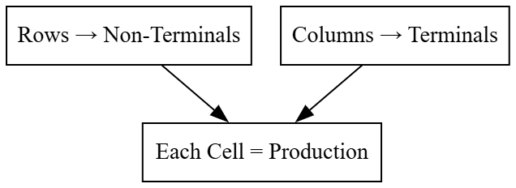
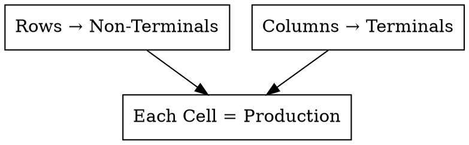
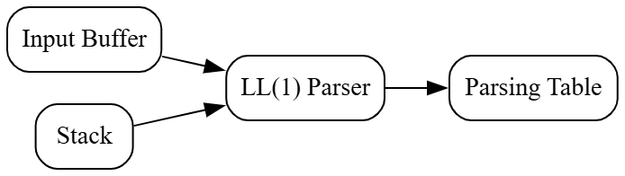
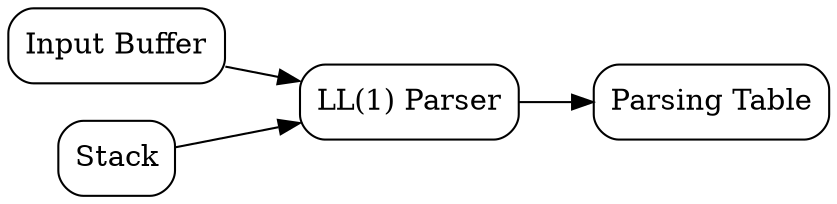
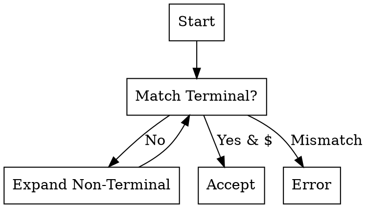

# Principles of Compiler Design
# Lecture 15 - Predictive Parsing and LL(1) Parsing Table

**Course:** B.Tech Information Technology (Semester VII)
**Module:** 2 - Syntax Analysis
**Duration:** 60 Minutes

---

# Learning Objectives

After completing this lecture, students should be able to:

- Explain the need for a Predictive Parsing Table.
- Understand the structure of an LL(1) Parsing Table.
- Explain the meaning of rows and columns.
- Construct table entries using FIRST and FOLLOW.
- Understand why LL(1) parsing avoids backtracking.

---

# Revision

In the previous lecture, we computed

- FIRST Sets
- FOLLOW Sets

But a question still remains.

> **How does the parser actually use these sets?**

The answer is

**LL(1) Parsing Table**

---

# Motivation

Consider the grammar

```text
E → TE'

E' → +TE' | ε

T → FT'

T' → *FT' | ε

F → id | (E)
```

Suppose the parser is currently processing

```text
E
```

and the next input token is

```text
id
```

Which production should it choose?

Instead of searching every production,

the parser simply looks up a table.

This table is called the

# LL(1) Parsing Table

---

# What is an LL(1) Parsing Table?

An LL(1) Parsing Table is a two-dimensional table that helps a Predictive Parser choose the correct production.

The parser makes its decision using

- Current Non-Terminal
- Current Input Token

Each table entry contains

- One production, or
- Error

---

# Why is it called LL(1)?

The notation **LL(1)** has a specific meaning.

| Symbol | Meaning |
|----------|---------|
| First **L** | Scan the input from **Left to Right** |
| Second **L** | Construct the **Leftmost Derivation** |
| **1** | Look ahead by **one input symbol** |

Therefore,

an LL(1) parser reads the input from left to right, constructs a leftmost derivation, and makes each decision by looking at only one input symbol.

---

# Structure of an LL(1) Table

The parsing table consists of

- Rows → Non-Terminals
- Columns → Terminals (including `$`)

Each cell contains the production to be used.

Example

|      | id | + | * | ( | ) | $ |
|------|----|----|----|----|----|----|
| E | | | | | | |
| E' | | | | | | |
| T | | | | | | |
| T' | | | | | | |
| F | | | | | | |

Initially,

every cell is empty.

---

# Figure 15.1 : Structure of LL(1) Parsing Table



---

### Graphviz (Dreampuf) Code



Save as

```text
images/lec15_fig01_table_structure.png
```

---

# How Does the Parser Use the Table?

Suppose

Current Non-Terminal

```text
E
```

Current Input Token

```text
id
```

The parser looks at

```text
Table[E, id]
```

If the entry contains

```text
E → TE'
```

the parser applies that production.

No searching.

No guessing.

No backtracking.

---

# Think Like a Compiler 💡

Imagine visiting a railway station.

Instead of asking many people

"Which platform should I go to?"

you simply check the electronic display board.

```
Train Number

↓

Platform Number
```

Similarly,

the parser checks

```
Non-Terminal + Input Symbol

↓

Production Rule
```

The parsing table is like the station display board.

---

# How Are Table Entries Filled?

Each production is placed into the table using

- FIRST Set
- FOLLOW Set (only when ε is involved)

This is why we spent the previous lecture computing these sets.

---

# Rule 1

Suppose we have

```text
A → α
```

For every terminal

```text
a ∈ FIRST(α)
```

place

```text
A → α
```

in

```text
Table[A, a]
```

---

# Example 1

Production

```text
F → id
```

We know

```text
FIRST(id)

=

{ id }
```

Therefore,

place

```text
F → id
```

in

```text
Table[F, id]
```

---

# Example 2

Production

```text
F → (E)
```

We know

```text
FIRST((E))

=

{ ( }
```

Therefore,

place

```text
F → (E)
```

in

```text
Table[F, (]
```

---

# Inside the Compiler 🔍

Notice that the parser never compares an input token against every production.

Instead,

it performs a simple table lookup.

```
Current Non-Terminal

+

Current Input Symbol

↓

One Table Entry

↓

One Production
```

This makes Predictive Parsing very efficient.

---

# Common Student Mistakes

❌ Rows contain terminals.

Wrong.

Rows always represent Non-Terminals.

---

❌ Columns contain Non-Terminals.

Wrong.

Columns represent terminal symbols (including `$`).

---

❌ FIRST and FOLLOW are not used after computation.

Wrong.

They are directly used to construct the parsing table.

---

# Classroom Activity

Using the running grammar, ask students to identify the correct table entries for:

```text
F → id

F → (E)
```

Expected Answer

```text
Table[F, id] = F → id

Table[F, (] = F → (E)
```

---

# Summary

In this part, we learned:

- Why an LL(1) Parsing Table is needed.
- Meaning of LL(1).
- Structure of the parsing table.
- How FIRST determines table entries.
- How the parser uses the table.

---

---

# Constructing the LL(1) Parsing Table

In the previous part, we learned:

- Structure of an LL(1) Parsing Table
- How FIRST determines table entries

Now we will construct the complete parsing table for our running grammar.

---

# Running Grammar

```text
E  → T E'

E' → + T E' | ε

T  → F T'

T' → * F T' | ε

F  → id | (E)
```

---

# Step 1 : Create an Empty Table

Create a table with

- Rows = Non-Terminals
- Columns = Terminals + End Marker ($)

|      | id | + | * | ( | ) | $ |
|------|----|----|----|----|----|----|
| E | | | | | | |
| E' | | | | | | |
| T | | | | | | |
| T' | | | | | | |
| F | | | | | | |

Initially,

all entries are empty.

---

# Step 2 : Fill Entries Using FIRST

## Production

```text
E → TE'
```

We know

```text
FIRST(TE')

=

FIRST(T)

=

{ id , ( }
```

Therefore,

place

```text
E → TE'
```

in

```text
M[E,id]

M[E,(]
```

---

## Production

```text
E' → +TE'
```

FIRST

```text
{ + }
```

Therefore,

place

```text
E' → +TE'
```

in

```text
M[E', +]
```

---

## Production

```text
T → FT'
```

FIRST

```text
{ id , ( }
```

Place

```text
T → FT'
```

in

```text
M[T,id]

M[T,(]
```

---

## Production

```text
T' → *FT'
```

FIRST

```text
{ * }
```

Place

```text
T' → *FT'
```

in

```text
M[T', *]
```

---

## Production

```text
F → id
```

FIRST

```text
{ id }
```

Place

```text
F → id
```

in

```text
M[F,id]
```

---

## Production

```text
F → (E)
```

FIRST

```text
{ ( }
```

Place

```text
F → (E)
```

in

```text
M[F,(]
```

---

# Step 3 : Handle ε-Productions

Now consider

```text
E' → ε
```

Since FIRST contains ε,

we use FOLLOW(E').

We already computed

```text
FOLLOW(E')

=

{ ) , $ }
```

Therefore,

place

```text
E' → ε
```

in

```text
M[E', )]

M[E', $]
```

---

Similarly,

```text
T' → ε
```

FOLLOW(T')

```text
{ + , ) , $ }
```

Therefore,

place

```text
T' → ε
```

in

```text
M[T', +]

M[T', )]

M[T', $]
```

---

# Complete LL(1) Parsing Table

| Non-Terminal | id | + | * | ( | ) | $ |
|---------------|----|----|----|----|----|----|
| **E** | E → TE' | Error | Error | E → TE' | Error | Error |
| **E'** | Error | E' → +TE' | Error | Error | E' → ε | E' → ε |
| **T** | T → FT' | Error | Error | T → FT' | Error | Error |
| **T'** | Error | T' → ε | T' → *FT' | Error | T' → ε | T' → ε |
| **F** | F → id | Error | Error | F → (E) | Error | Error |

---

# Figure 15.2 : Completed LL(1) Parsing Table


### Note

Instead of generating this table using Graphviz, create it directly in Markdown and take a screenshot if you want to include it as an image. Tables are much clearer than node diagrams for LL(1) parsing.

---

# Why Are Some Cells "Error"?

Suppose the parser is in state

```text
E
```

and the next input token is

```text
+
```

There is no valid production beginning with

```text
+
```

Therefore,

```text
M[E,+]

=

Error
```

An Error entry means

> **The input string does not follow the grammar at this point.**

---

# Is This Grammar LL(1)?

A grammar is called **LL(1)** if

1. Every table cell contains **at most one production**.
2. No table cell contains multiple productions (no conflicts).

Look at the table.

Every filled cell contains exactly one production.

Hence,

the grammar is

```text
LL(1)
```

---

# How Does the Parser Use This Table?

Suppose

Stack Top

```text
E
```

Input Symbol

```text
id
```

The parser looks at

```text
M[E,id]
```

The table returns

```text
E → TE'
```

The parser replaces

```text
E
```

with

```text
TE'
```

The process continues until

- the input is accepted, or
- an Error entry is encountered.

---

# Think Like a Compiler 💡

Imagine using a dictionary.

You don't read the whole dictionary to find a word.

You simply

- Identify the first letter.
- Go to the correct page.
- Read the matching entry.

Similarly,

the parser uses

- Current Non-Terminal
- Current Input Symbol

to jump directly to the correct production.

---

# Common Student Mistakes

❌ Using FOLLOW for every production.

Wrong.

FOLLOW is used **only** when the production can derive ε.

---

❌ Filling multiple productions in one table cell.

Wrong.

If a cell contains more than one production, the grammar is **not LL(1)**.

---

❌ Leaving Error cells blank.

Wrong.

Conceptually, all unused cells represent parsing errors.

---

# Classroom Activity

Using the completed table, ask students:

1. Which production is selected for `M[F,id]`?
2. Which production is selected for `M[T',+]`?
3. What is stored in `M[E,+]`?
4. Why is `M[E', $] = E' → ε`?

Discuss each answer using FIRST and FOLLOW.

---

# Summary

In this part, we learned:

- How to construct an LL(1) Parsing Table.
- How FIRST fills normal entries.
- How FOLLOW fills ε-production entries.
- Why Error entries exist.
- How to verify whether a grammar is LL(1).

---

---

# From Parsing Table to Parsing Algorithm

We have successfully constructed the LL(1) Parsing Table.

The next question is

> **How does the parser actually use this table to parse an input string?**

The answer is

A **stack-based Predictive Parsing Algorithm**.

---

# Basic Idea

The parser maintains two important data structures.

1. **Input Buffer**
2. **Stack**

The parser repeatedly compares

- the **top of the stack**
- the **current input symbol**

Based on these two values,

it consults the LL(1) Parsing Table and decides the next action.

---

# Components of an LL(1) Parser

```text
                 Input Buffer
                       │
                       ▼
                +--------------+
                |  LL(1) Parser|
                +--------------+
                 ▲          │
                 │          ▼
              Stack    Parsing Table
```

---

## Figure 15.3 : Components of an LL(1) Parser



---

### Graphviz (Dreampuf) Code



Save as

```text
images/lec15_fig03_ll1_components.png
```

---

# Initial Configuration

Before parsing begins,

the parser initializes

## Stack

```text
$

E
```

where

- `E` is the Start Symbol.
- `$` is the End Marker.

Input

```text
id + id * id $
```

Notice

Both the stack and the input end with

```text
$
```

---

# Parser Actions

At every step,

the parser performs one of the following actions.

### Action 1 : Match

If the stack top is a terminal and matches the current input symbol,

- Remove the terminal from the stack.
- Advance the input pointer.

Example

```text
Stack Top

id

Input

id
```

Action

```text
Match
```

---

### Action 2 : Expand

If the stack top is a Non-Terminal,

consult the LL(1) Parsing Table.

Example

```text
Stack Top

E

Input

id
```

Lookup

```text
M[E,id]
```

Result

```text
E → TE'
```

Replace `E` on the stack with

```text
TE'
```

(remember that symbols are pushed in reverse order so that `T` is processed first).

---

### Action 3 : Accept

If

```text
Stack Top = $

Input = $
```

the parser reports

```text
Accepted
```

The input string follows the grammar.

---

### Action 4 : Error

If

- the terminals do not match, or
- the table entry contains **Error**,

the parser reports

```text
Syntax Error
```

and stops parsing.

---

# Predictive Parsing Algorithm (High-Level)

1. Push `$` and the Start Symbol onto the stack.
2. Read the first input symbol.
3. Repeat until parsing finishes:
   - If the stack top is a terminal:
     - If it matches the input, pop it and advance the input.
     - Otherwise, report an error.
   - If the stack top is a Non-Terminal:
     - Consult the LL(1) Parsing Table.
     - Replace the Non-Terminal using the selected production.
     - If the production is `ε`, simply remove the Non-Terminal from the stack.
4. If both the stack and the input contain only `$`, accept the string.

---

# Figure 15.4 : Predictive Parsing Flow


---

### Graphviz (Dreampuf) Code



Save as

```text
images/lec15_fig04_predictive_flow.png
```

---

# Think Like a Compiler 💡

Imagine following GPS navigation.

At every intersection,

you don't plan the entire journey again.

Instead,

you simply ask

> **"Given my current location, what is the next move?"**

The LL(1) parser works in exactly the same way.

It uses

- Current Stack Top
- Current Input Symbol

to decide only the **next action**.

---

# Common Student Mistakes

❌ Push the production onto the stack from left to right.

Wrong.

Push the symbols **from right to left** so that the leftmost symbol is processed first.

Example

Production

```text
E → TE'
```

Push onto the stack as

```text
E'

T
```

After pushing, `T` becomes the top of the stack.

---

❌ Remove the input symbol when expanding a Non-Terminal.

Wrong.

The input pointer moves **only** after a successful terminal match.

---

❌ Remove ε from the input.

Wrong.

ε represents the empty string.

Nothing is pushed onto the stack and nothing is consumed from the input.

---

# Classroom Activity

Given

```text
Stack

$

E
```

Input

```text
id + id $
```

Ask students:

1. Which table entry will be consulted first?
2. Which production will be applied?
3. What will the stack contain after expansion?

Expected Answer

- Consult `M[E,id]`
- Apply `E → TE'`
- Push `E'` then `T`

---

# Summary

In this part, we learned:

- Components of an LL(1) Parser.
- Stack and Input Buffer.
- Four parser actions: Match, Expand, Accept, and Error.
- High-level Predictive Parsing Algorithm.
- Why productions are pushed in reverse order.

---

# End of Lecture 15

## Key Takeaways

- The LL(1) Parsing Table guides the parser.
- The parser maintains a stack and an input buffer.
- Parsing proceeds through repeated table lookups and stack operations.
- Matching consumes input, while expansion replaces Non-Terminals.
- Acceptance occurs when both the stack and input contain only `$`.

---

# Looking Ahead

**Lecture 16: LL(1) Parsing Example and Introduction to Bottom-Up Parsing**

We will perform a complete LL(1) parsing trace for the input:

```text
id + id * id
```

using the parsing table constructed in this lecture. We will then briefly introduce **Bottom-Up Parsing** and compare it with **Top-Down Parsing**, preparing for Module 3.