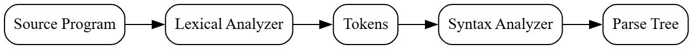
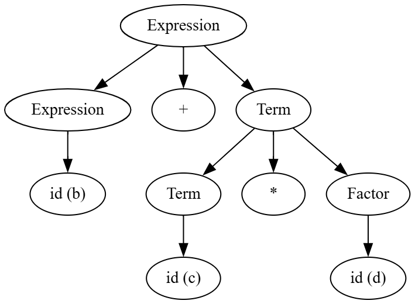
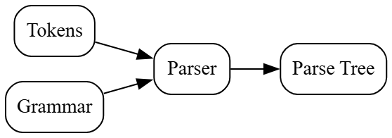

# Principles of Compiler Design
# Lecture 9 - Introduction to Syntax Analysis

**Course:** B.Tech Information Technology (Semester VII)  
**Module:** 2 - Syntax Analysis  
**Lecture Duration:** 60 Minutes

---

# Learning Objectives

After completing this lecture, students should be able to:

- Explain the purpose of Syntax Analysis.
- Differentiate between Lexical Analysis and Syntax Analysis.
- Understand why a Parser is required.
- Explain the role of Syntax Analysis in the Compiler.
- Interpret a simple Parse Tree.

---

# Revision of Module 1

In Module 1, we studied the first phase of the compiler.

The flow was

```text
Source Program

        │

Lexical Analyzer

        │

Tokens

        │

Syntax Analyzer (Next Phase)
```

The Lexical Analyzer successfully converted characters into **tokens**.

Now a new question arises.

> **Are the tokens arranged according to the grammar of the programming language?**

This question is answered by the **Syntax Analyzer**.

---

# Motivation

Consider the following statement.

```c
a = b + c * d;
```

The Lexical Analyzer converts it into

```text
<ID,a>

<ASSIGN,=>

<ID,b>

<PLUS,+>

<ID,c>

<MULT,*>

<ID,d>

<SEMICOLON,;>
```

Notice something important.

The compiler now has **tokens**.

But does it know whether these tokens form a valid statement?

**No.**

That is the responsibility of the **Syntax Analyzer**.

---

# What is Syntax Analysis?

Syntax Analysis is the **second phase of the compiler**.

Its purpose is to check whether the sequence of tokens follows the grammar of the programming language.

If the sequence is correct,

the compiler proceeds to the next phase.

Otherwise,

it reports a **syntax error**.

---

# Definition

> **Syntax Analysis is the process of verifying whether the sequence of tokens produced by the Lexical Analyzer conforms to the grammar of the programming language.**

---

# Think Like a Compiler 💡

Imagine the sentence

```text
I am going to college.
```

This sentence is grammatically correct.

Now consider

```text
College going am I to.
```

All the words are valid English words.

But the sentence is incorrect because the **order** of the words is wrong.

Similarly,

the Lexical Analyzer checks

> "Are these valid words?"

The Syntax Analyzer checks

> "Are these words arranged according to grammar?"

---

# Another Example

Consider

```c
a = b + c;
```

This is syntactically correct.

Now consider

```c
= + a b c ;
```

Every token is valid.

But the arrangement is invalid.

Therefore,

the Syntax Analyzer reports an error.

---

# Lexical Analyzer vs Syntax Analyzer

| Lexical Analyzer | Syntax Analyzer |
|------------------|-----------------|
| Reads characters | Reads tokens |
| Produces tokens | Checks grammar |
| Uses Regular Expressions | Uses Context-Free Grammar |
| Implemented using Finite Automata | Implemented using Parsing Techniques |
| Reports lexical errors | Reports syntax errors |

---

# Inside the Compiler 🔍

The compiler pipeline now becomes

```text
Source Program

        │

Lexical Analyzer

        │

Tokens

        │

Syntax Analyzer

        │

Parse Tree

        │

Semantic Analysis
```

Notice the new output.

The Syntax Analyzer produces a **Parse Tree**, which represents the grammatical structure of the program.

---

## Figure 9.1 : Position of Syntax Analyzer in Compiler



---

# Why is Syntax Analysis Needed?

Suppose the compiler receives

```c
int a = ;
```

The Lexical Analyzer recognizes

```text
int

a

=

;
```

Every token is valid.

However,

there is **no expression after the assignment operator**.

The statement violates the grammar of the language.

Therefore,

the Syntax Analyzer reports

```text
Syntax Error
```

---

# Classroom Discussion

> Can the Lexical Analyzer detect the error in

```c
int a = ;
```

Expected answer:

**No.**

All tokens are valid.

Only the Syntax Analyzer can detect that the statement is grammatically incorrect.

---

# What is a Parse Tree?

A **Parse Tree** (also called a **Syntax Tree** in introductory discussions, though technically they are different) is a tree representation that shows **how a program is derived according to the grammar of the programming language**.

It shows the grammatical structure of the input.

The Parser constructs this tree after verifying that the input follows the grammar.

---

# Think Like a Compiler 💡

Suppose a teacher asks you to analyze the English sentence.

```text
The boy eats mangoes.
```

You don't simply say,

> "Yes, it is correct."

Instead, you identify its grammatical structure.

```text
Sentence

├── Subject

│      └── The boy

└── Predicate

       └── eats mangoes
```

Similarly,

the compiler does not simply say

> "The statement is correct."

It also determines **how the statement is constructed**.

This structure is represented using a **Parse Tree**.

---

# Running Example

Throughout Module 2, we will use the following statement.

```c
a = b + c * d;
```

After Lexical Analysis,

the Parser receives

```text
ID  =  ID  +  ID  *  ID  ;
```

Now the Parser must determine

- Is this expression valid?
- Which operator is evaluated first?
- Which operands belong together?

The Parse Tree answers all these questions.

---

# Before Drawing a Parse Tree

The compiler requires a grammar.

Consider the following simple grammar.

```text
Expression → Expression + Term

Expression → Term

Term → Term * Factor

Term → Factor

Factor → id
```

Don't worry if the grammar looks unfamiliar.

We will study Context-Free Grammars in the next lecture.

For now,

assume these are the rules of the language.

---

# Understanding the Grammar

The grammar tells us

- An Expression can contain another Expression and a '+' operator.
- A Term can contain another Term and a '*' operator.
- A Factor is simply an identifier.

This grammar naturally gives

`*`

higher precedence than

`+`

which matches arithmetic rules.

---

# Parse Tree for

```text
b + c * d
```

## Figure 9.2 : Parse Tree for an Expression



---

# How to Read the Parse Tree

Start from the root.

```
Expression
```

The grammar says

```
Expression

↓

Expression + Term
```

Therefore,

the tree first expands into

```text
Expression

↓

Expression + Term
```

The left Expression becomes

```text
id(b)
```

The Term becomes

```text
Term * Factor
```

which finally becomes

```text
id(c) * id(d)
```

The Parse Tree now represents

```text
b + c * d
```

---

# Important Observation

Notice that

```
c * d
```

appears together in one subtree.

This tells the compiler that

multiplication must be performed before addition.

The Parse Tree therefore captures the **operator precedence** defined by the grammar.

---

# Inside the Compiler 🔍

The Parser performs the following steps.

```text
Tokens

↓

Apply Grammar Rules

↓

Build Parse Tree

↓

Pass Parse Tree to Semantic Analyzer
```

The Parser does **not** evaluate the expression.

It only checks the grammar and builds the tree.

---

# Parse Tree is NOT Execution

Consider

```c
10 + 20 * 30
```

The Parse Tree does **not** calculate

```text
610
```

Instead,

it only represents

```text
10 + (20 * 30)
```

The actual calculation happens much later during code generation or execution.

---

# Common Student Doubts

## Doubt 1

**Does the Parser execute the program?**

No.

It only checks grammar.

---

## Doubt 2

**Does the Parse Tree store values?**

No.

It stores the grammatical structure of the program.

---

## Doubt 3

**Why can't we directly use tokens?**

Because tokens only tell us **what** is present.

The Parse Tree tells us **how those tokens are related**.

---

# Classroom Activity

```text
a+b

a*b

a+b*c

(a+b)*c
```


> Which operator should become the root of the Parse Tree?

---

# Summary

In this part, we learned:

- What is a Parse Tree?
- Why a Parse Tree is needed.
- How a Parser constructs a Parse Tree.
- Difference between tokens and Parse Trees.
- How operator precedence is reflected in the Parse Tree.

---

---

# How Does the Parser Know the Rules?

So far we have learned that

- The Lexical Analyzer produces **tokens**.
- The Syntax Analyzer checks whether the tokens are arranged correctly.
- The Parser builds a Parse Tree.

Now an important question arises.

> **How does the Parser know what is correct and what is incorrect?**

The answer is:

**The Parser follows a Grammar.**

Just as English follows English grammar,

every programming language also follows its own grammar.

---

# Grammar in Everyday Life

Consider the English sentence

```text
Sachin teaches Compiler Design.
```

Its grammatical structure is

```text
Sentence

↓

Subject + Verb + Object
```

Another valid sentence is

```text
Students learn Compiler Design.
```

It follows exactly the same rule.

However,

```text
Compiler Design teaches Sachin.
```

contains valid English words,

but the arrangement is incorrect for the intended meaning.

Grammar tells us **how words should be arranged**.

Programming languages also require such rules.

---

# Grammar in Programming Languages

Consider the statement

```c
a = b + c;
```

This is valid.

Now consider

```c
+ = b a c ;
```

All the individual tokens are valid.

However,

their arrangement violates the grammar of the language.

Therefore,

the Parser reports a syntax error.

---

# Where Does Grammar Come From?

The grammar is **not invented by the compiler**.

It is defined by the **language designer**.

For example,

the designers of

- C
- C++
- Java
- Python

defined the grammatical rules of their languages.

Compiler writers implement these rules inside the parser.

---

# Inside the Compiler 🔍

The complete flow now becomes

```text
Source Program

        │

Lexical Analyzer

        │

Tokens

        │

Grammar

        │

Parser

        │

Parse Tree

        │

Semantic Analysis
```

Notice something important.

The Parser does not make random decisions.

It always follows the grammar.

---

## Figure 9.3 : Role of Grammar in Parsing



---

# Think Like a Compiler 💡

Imagine a GPS navigation system.

The GPS does not randomly choose roads.

It follows a **map**.

Similarly,

the Parser does not randomly arrange tokens.

It follows a **Grammar**.

```text
Grammar

↓

Parser

↓

Correct Program Structure
```

Without a grammar,

the parser cannot determine whether a program is valid.

---

# From Today's Lecture to the Next

Today we have answered

- Why is Syntax Analysis needed?
- What is a Parser?
- What is a Parse Tree?
- Why does a Parser need a Grammar?

The next question naturally becomes

> **What exactly is a Grammar?**

This will be the topic of the next lecture.

---

# Quick Revision

```text
Characters

↓

Lexical Analyzer

↓

Tokens

↓

Grammar

↓

Parser

↓

Parse Tree
```

Remember:

- The **Lexical Analyzer** recognizes tokens.
- The **Parser** recognizes grammatical structure.

---

# Viva Questions

1. What is Syntax Analysis?
2. What is the role of a Parser?
3. What is a Parse Tree?
4. Why is a Parse Tree required?
5. What is the difference between Lexical Analysis and Syntax Analysis?
6. Can the Parser work without a Grammar?
7. Who defines the grammar of a programming language?
8. What is the output of the Parser?
9. Which compiler phase follows Syntax Analysis?
10. What kind of errors are detected during Syntax Analysis?

---

# University Questions

## Two Marks

- Define Syntax Analysis.
- Define Parse Tree.
- State the role of a Parser.
- What is the output of Syntax Analysis?

---

## Five Marks

- Explain the role of the Syntax Analyzer in a compiler.
- Differentiate between Lexical Analysis and Syntax Analysis.
- Explain the need for a Parse Tree.

---

## Ten Marks

- Explain the Syntax Analysis phase of a compiler with a neat diagram.
- Explain the role of the Parser and Parse Tree in compiler design.

---

# End of Lecture 9

## Key Takeaways

- Syntax Analysis is the **second phase** of the compiler.
- It works on the **tokens** produced by the Lexical Analyzer.
- The Parser checks whether the token sequence follows the **grammar** of the programming language.
- If the input is valid, the Parser builds a **Parse Tree**.
- The Parse Tree represents the **grammatical structure** of the program.
- The Parser relies on **grammar rules** to make every parsing decision.

---

# Looking Ahead

**Lecture 10: Context-Free Grammars (CFG)**

We will study:

- What is a Grammar?
- Components of a Context-Free Grammar
- Terminals
- Non-terminals
- Production Rules
- Start Symbol
- Examples of CFG
- Why CFG is used in Compiler Design

This is the foundation for understanding all parsing techniques in the remaining lectures of Module 2.