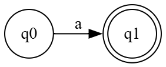
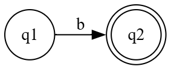

# Principles of Compiler Design Lab
# Experiment 1

## Title

**Implementation of Finite Automata for Regular Languages**

**Course:** B.Tech Information Technology (Semester VII)

**Course Code:** 231ITUCL72

**Experiment No.:** 1

**CO Mapping:** CO1

---

# Aim

To understand the concept of Finite Automata and implement Deterministic Finite Automata (DFA) in C for recognizing Regular Languages.

---

# Learning Objectives

After completing this experiment, students should be able to:

- Understand the working of a Finite Automaton.
- Represent DFA using states and transitions.
- Convert a DFA into a C program.
- Trace the execution of DFA for different input strings.
- Explain the relationship between Regular Expressions and DFA.

---

# Software Requirements

- GCC Compiler / Turbo C++ / CodeBlocks / Visual Studio Code
- Operating System: Windows / Linux

---

# Prerequisites

Students should know:

- Tokens
- Regular Expressions
- DFA
- States
- Transition Diagram

---

# Theory

A **Finite Automaton (FA)** is a mathematical model used to recognize patterns in strings.

In Compiler Design, the **Lexical Analyzer** uses Finite Automata to recognize tokens such as

- Identifiers
- Keywords
- Numbers
- Operators
- Delimiters

Instead of checking every possible string manually, the compiler moves through a sequence of **states**.

After reading the complete input,

- if the automaton reaches an **accepting state**, the string is accepted.
- otherwise, it is rejected.

Thus,

Finite Automata provide an efficient mechanism for token recognition during lexical analysis.

---

# Real Compiler Connection

Think about the following C statement.

```c
int marks = 100;
```

The lexical analyzer reads

```
i
↓

n
↓

t
```

and recognizes

```
KEYWORD
```

Then it reads

```
m
↓

a
↓

r
↓

k
↓

s
```

and recognizes

```
IDENTIFIER
```

This recognition process is performed using **Finite Automata**.

---

# Inside the Compiler 🔍

The complete process is

```text
Source Program

        │

Characters

        │

Finite Automata

        │

Recognized Tokens

        │

Parser
```

---

# Experiment 1 - Program 1

## Problem Statement

Write a C program to implement a Deterministic Finite Automaton (DFA) that accepts **only the string**

```text
ab
```

---

# Language Accepted

```
L = {ab}
```

Accepted

```text
ab
```

Rejected

```text
a

b

abb

aba

aa

ba

(empty string)
```

---

# DFA Design

The DFA consists of three states.

- q0 → Start State
- q1 → Intermediate State
- q2 → Accepting State

---

## Figure 1.1 : DFA for "ab"


---

# State Transition Table

| Current State | Input | Next State |
|--------------|-------|------------|
| q0 | a | q1 |
| q1 | b | q2 |

Any other transition results in rejection.

---

# Algorithm

1. Start.
2. Read the input string.
3. Initialize the current state to q0.
4. Read one character at a time.
5. Change the state according to the transition table.
6. If an invalid transition occurs, reject the string.
7. After reading all characters,
   - if the current state is q2, accept the string.
   - otherwise reject the string.
8. Stop.

---

# Flowchart

(To be drawn by students during the laboratory session.)

---

# Think Before Coding 💡

Suppose the input is

```text
ab
```

The DFA moves as

```
q0

↓

a

↓

q1

↓

b

↓

q2

Accepted
```

Now consider

```text
abb
```

```
q0

↓

a

↓

q1

↓

b

↓

q2

↓

b

?

No transition exists.

Rejected.
```

Notice that

the C program will simply simulate these state changes.

It does **nothing more** than following the DFA.

---

# Program

```c
#include <stdio.h>
#include <string.h>

int main()
{
    char str[100];
    int state = 0;
    int i;

    printf("Enter the string: ");
    scanf("%s", str);

    for(i = 0; str[i] != '\0'; i++)
    {
        switch(state)
        {
            case 0:
                if(str[i] == 'a')
                    state = 1;
                else
                    state = -1;
                break;

            case 1:
                if(str[i] == 'b')
                    state = 2;
                else
                    state = -1;
                break;

            case 2:
                state = -1;
                break;
        }

        if(state == -1)
            break;
    }

    if(state == 2 && str[i] == '\0')
        printf("\nString Accepted.");
    else
        printf("\nString Rejected.");

    return 0;
}
```

---

# Understanding the Program

The entire program is based on one simple idea.

> **Each DFA state is represented by an integer variable called `state`.**

| DFA State | Program Variable |
|-----------|------------------|
| q0 | state = 0 |
| q1 | state = 1 |
| q2 | state = 2 |
| Invalid State | state = -1 |

Instead of drawing circles and arrows,

the program simply changes the value of `state`.

---

# Inside the Code 🔍

## Step 1

```c
int state = 0;
```

Initially,

the DFA always starts from

```
q0
```

Therefore

```
state = 0
```

represents

```
Current State = q0
```

---

## Step 2

```c
scanf("%s", str);
```

The input string is read from the user.

Example

```
ab
```

is stored as

```
str[0] = 'a'

str[1] = 'b'

str[2] = '\0'
```

---

## Step 3

```c
for(i = 0; str[i] != '\0'; i++)
```

The DFA reads **one character at a time**.

This loop performs exactly that.

For example,

```
Input

a b
```

Iteration 1

```
Current Character

a
```

Iteration 2

```
Current Character

b
```

Notice that

the compiler never reads the entire word together.

It always processes **one character at a time**.

---

# Why Character by Character?

This is an important compiler concept.

Suppose the compiler receives

```c
result123
```

It does **not** read

```
result123
```

as one complete word.

Instead it reads

```
r

↓

e

↓

s

↓

u

↓

l

↓

t

↓

1

↓

2

↓

3
```

Each character causes a transition to another state.

This is exactly how a Lexical Analyzer works.

---

## Step 4

```c
switch(state)
```

The DFA behaves differently depending on its current state.

Instead of drawing arrows,

we write

```c
switch(state)
```

Each

```
case
```

represents one DFA state.

---

# Mapping Between DFA and Program

| DFA State | Program |
|-----------|----------|
| q0 | case 0 |
| q1 | case 1 |
| q2 | case 2 |

This is the most important observation in this experiment.

---

## Step 5

```c
case 0:
```

means

The automaton is currently at

```
q0
```

Now check the input.

---

```c
if(str[i]=='a')
    state=1;
```

Meaning

```
Current State

q0

Input

a

↓

Move To

q1
```

Exactly the same transition shown in the DFA.

---

## Figure 1.2 : Transition q0 → q1



---

## Step 6

```c
else
    state = -1;
```

Suppose

Current State

```
q0
```

Input

```
b
```

There is **no transition**.

Therefore

the DFA immediately rejects the string.

The program represents rejection as

```
state = -1
```

---

## Step 7

```c
case 1:
```

means

Current DFA State

```
q1
```

Now check

```c
if(str[i]=='b')
    state=2;
```

Meaning

```
q1

↓

b

↓

q2
```

---

## Figure 1.3 : Transition q1 → q2



---

## Step 8

```c
case 2:
```

The DFA has already accepted

```
ab
```

If another character arrives,

for example

```
abb
```

there is no outgoing transition.

Therefore

```c
state = -1;
```

rejects the string.

---

# Complete State Mapping

| Current State | Input | Next State |
|--------------|-------|------------|
| q0 | a | q1 |
| q0 | b | Reject |
| q1 | b | q2 |
| q1 | a | Reject |
| q2 | Any Input | Reject |

This table is exactly implemented by the C program.

---

# Important Observation

The C program does **not** understand English.

It does **not** understand Regular Expressions.

It simply changes

```
state

↓

0

↓

1

↓

2
```

according to the transition table.

This is how every DFA program works.

---

---

# Dry Run

Let us execute the program manually.

## Case 1 : Input = `ab`

Initially,

```text
state = 0
```

### Iteration 1

Current Character

```text
a
```

Current State

```text
q0
```

Transition

```text
q0 --a--> q1
```

Program executes

```c
state = 1;
```

Current State becomes

```text
q1
```

---

### Iteration 2

Current Character

```text
b
```

Current State

```text
q1
```

Transition

```text
q1 --b--> q2
```

Program executes

```c
state = 2;
```

Current State becomes

```text
q2
```

Input ends.

Final State

```text
q2
```

Since **q2** is the accepting state,

**Result: String Accepted**

---

# Dry Run Table

| Iteration | Input Character | Previous State | Next State |
|-----------|-----------------|----------------|------------|
| 1 | a | q0 | q1 |
| 2 | b | q1 | q2 |

---

# Dry Run 2

## Input

```text
abb
```

Initial State

```text
q0
```

| Character | Current State | Next State |
|-----------|---------------|------------|
| a | q0 | q1 |
| b | q1 | q2 |
| b | q2 | Reject |

Result

```text
Rejected
```

Reason

There is no transition from **q2** for any additional character.

---

# Dry Run 3

## Input

```text
ba
```

First Character

```text
b
```

Current State

```text
q0
```

No valid transition exists.

The program immediately sets

```c
state = -1;
```

Result

```text
Rejected
```

---

# Sample Input and Output

## Example 1

**Input**

```text
ab
```

**Output**

```text
String Accepted.
```

---

## Example 2

**Input**

```text
abb
```

**Output**

```text
String Rejected.
```

---

## Example 3

**Input**

```text
a
```

**Output**

```text
String Rejected.
```

---

## Example 4

**Input**

```text
ba
```

**Output**

```text
String Rejected.
```

---

# Time Complexity

The program scans the string exactly once.

If the input string contains **n** characters,

each character is processed only once.

Therefore,

**Time Complexity**

```text
O(n)
```

---

# Space Complexity

Only one variable is used to represent the DFA state.

Hence,

```text
O(1)
```

---

# Common Errors

### Error 1

Forgetting to initialize

```c
state = 0;
```

The DFA must always start from the start state.

---

### Error 2

Using

```c
gets()
```

instead of

```c
scanf()
```

Avoid `gets()` because it is unsafe.

---

### Error 3

Forgetting

```c
break;
```

inside the `switch` statement.

This causes unintended fall-through.

---

### Error 4

Accepting the string before checking whether the entire input has been processed.

Always ensure that the complete string has been consumed before declaring acceptance.

---

# Think Like the CPU 🧠

Suppose the input is

```text
ab
```

The CPU executes the program as follows.

```text
state = 0

↓

Read 'a'

↓

Condition

state==0

AND

character=='a'

↓

TRUE

↓

state = 1

↓

Read 'b'

↓

Condition

state==1

AND

character=='b'

↓

TRUE

↓

state = 2

↓

End of String

↓

Accept
```

Notice that the CPU is **not aware of DFA theory**.

It simply evaluates conditions and updates variables.

---

# Real Compiler Connection

The same idea is used inside a compiler.

For example,

when the compiler reads

```text
while
```

it processes one character at a time.

```text
w

↓

h

↓

i

↓

l

↓

e
```

Each character causes a transition in the underlying automaton.

When the final accepting state is reached,

the lexical analyzer generates

```text
<KEYWORD, while>
```

The compiler uses this approach for every token.

---

# Viva Questions

1. What is a Finite Automaton?
2. What is a Regular Language?
3. What is a DFA?
4. Why is `state` used in the program?
5. Why is the input processed character by character?
6. What is the start state?
7. What is an accepting state?
8. What is the purpose of the `switch` statement?
9. Why is `state = -1` used?
10. What is the time complexity of the program?

---

# Lab Assignments

## Assignment 1

Modify the program to accept

```text
abb
```

---

## Assignment 2

Modify the DFA to accept

```text
abc
```

---

## Assignment 3

Modify the DFA to accept

```text
aa
```

---

## Assignment 4

Draw the DFA before writing the C program.

---

# Challenge Problems (Not for Evaluation)

### Challenge 1

Write a DFA that accepts

```text
a*
```

---

### Challenge 2

Write a DFA that accepts strings ending with

```text
ab
```

---

### Challenge 3

Write a DFA that accepts binary strings ending with

```text
01
```

---

# Conclusion

In this experiment, we studied the implementation of a Deterministic Finite Automaton (DFA) in C.

We learned how:

- States are represented using variables.
- Transitions are implemented using conditional statements.
- Input is processed one character at a time.
- Acceptance and rejection are determined by the final state.

This experiment forms the foundation for implementing lexical analyzers in compiler design.

---
