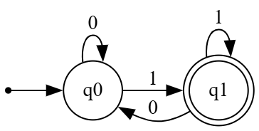
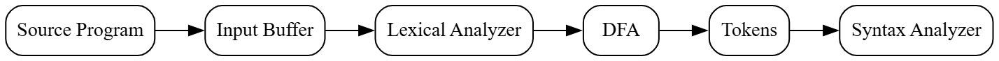

# Principles of Compiler Design
# Lecture 5 - Deterministic Finite Automata (DFA)

**Course:** B.Tech Information Technology (Semester VII)  
**Module:** 1 - Lexical Analysis  
**Lecture Duration:** 60 Minutes

---

# Learning Objectives

After completing this lecture, students should be able to:

- Explain what a Finite Automaton is.
- Define Deterministic Finite Automata (DFA).
- Explain all components of a DFA.
- Trace the execution of a DFA.
- Understand how DFA is used inside a compiler.

---

# Revision

In the previous lecture, we studied **Regular Expressions**.

A Regular Expression defines the pattern of a token.

Example:

| Token | Regular Expression |
|--------|--------------------|
| Identifier | `letter(letter|digit)*` |
| Integer | `digit+` |
| Keyword | `if` |

A question naturally arises.

> **How does a computer check whether an input string satisfies a Regular Expression?**

The answer is:

**Finite Automata**

---

# Introduction

Consider the following C statement.

```c
result = a + b * c;
```

The lexical analyzer reads

```text
result
```

How does it know that this is an **Identifier**?

It does **not** compare the word with every possible identifier.

Instead, it executes a **Finite Automaton**.

A Finite Automaton moves from one state to another while reading one character at a time.

If the final state is an accepting state, the string is accepted.

---

# What is a Finite Automaton?

## Definition

A **Finite Automaton (FA)** is a mathematical model used to recognize patterns.

It processes the input **one symbol at a time** and changes its state according to predefined transition rules.

If, after processing the complete input, the automaton reaches an accepting state, the string is accepted.

Otherwise, it is rejected.

---

# Real Life Analogy

Suppose you are entering an airport.

You pass through several checkpoints.

```
Entry
   │
   ▼
Ticket Check
   │
   ▼
Security Check
   │
   ▼
Boarding Gate
   │
   ▼
Inside Aircraft
```

Each checkpoint is a **State**.

Moving from one checkpoint to another is called a **Transition**.

If you successfully reach the final checkpoint, your journey is accepted.

Similarly,

A Finite Automaton moves through different states while processing the input string.

---

# Basic Terminology

Before learning DFA, we must understand some important terms.

---

## 1. Alphabet (Σ)

An Alphabet is a finite set of valid input symbols.

Examples

```text
Σ = {a,b}
```

```text
Σ = {0,1}
```

```text
Σ = {a,b,c,...,z}
```

---

## 2. String

A String is a sequence of symbols belonging to an Alphabet.

Example

Alphabet

```text
Σ = {a,b}
```

Valid Strings

```text
a

b

ab

aba

bbb

aaab
```

Invalid Strings

```text
1

abc

xy

12
```

because these symbols are not part of the alphabet.

---

## 3. State

A State represents the current condition of the automaton.

States are represented as

```text
q0

q1

q2

q3
```

Each state represents the progress made while reading the input.

---

## 4. Start State

The Start State is the state from which processing begins.

Every DFA has exactly **one** Start State.

---

## 5. Accepting State (Final State)

If the automaton finishes reading the complete input and reaches this state, the string is accepted.

Accepting states are drawn using **double circles**.

---

# Components of DFA

A DFA consists of five components.

| Symbol | Meaning |
|---------|----------|
| **Q** | Set of States |
| **Σ** | Input Alphabet |
| **δ** | Transition Function |
| **q₀** | Start State |
| **F** | Set of Final States |

Mathematically,

```text
M = (Q, Σ, δ, q₀, F)
```

---

# Example DFA

Suppose we want to recognize the string

```text
ab
```

The DFA is shown below.

---

## Figure 5.1 : DFA for Recognizing "ab"


---

# Understanding Figure 5.1

The DFA contains three states.

| State | Meaning |
|---------|----------|
| q0 | Start State |
| q1 | 'a' has been read |
| q2 | String "ab" recognized |

The transitions are

| Current State | Input | Next State |
|---------------|-------|------------|
| q0 | a | q1 |
| q1 | b | q2 |

Since q2 is a double-circle state, it is an **Accepting State**.

---

# Tracing Example 1

Input

```text
ab
```

Processing

| Step | Current State | Input | Next State |
|------|---------------|--------|------------|
| 1 | q0 | a | q1 |
| 2 | q1 | b | q2 |

The automaton stops in q2.

Therefore,

**Accepted**

---

# Tracing Example 2

Input

```text
aa
```

Processing

| Step | Current State | Input | Next State |
|------|---------------|--------|------------|
| 1 | q0 | a | q1 |
| 2 | q1 | a | No Transition |

The automaton cannot proceed further.

Hence,

**Rejected**

---

# Why is it Called Deterministic?

The word **Deterministic** means

> **For every state and every input symbol, there is exactly one possible transition.**

Example

Suppose the automaton is in state

```text
q0
```

and the input symbol is

```text
a
```

The DFA has only one choice.

```
q0
 │
 │ a
 ▼
q1
```

It cannot choose another state.

There is no ambiguity.

---

# Characteristics of DFA

A DFA always

- Reads one character at a time.
- Processes input from left to right.
- Never moves backward.
- Never skips an input character.
- Has exactly one transition for every input symbol.

---

# Important Points

✅ DFA reads **characters**, not words.

✅ DFA changes state after reading every character.

✅ DFA accepts a string only if it finishes in an accepting state.

✅ DFA is widely used in the **Lexical Analyzer** phase of a compiler.

---

# Remember

> A Regular Expression defines **what** a token looks like.

> A DFA defines **how** the computer recognizes that token.

This is one of the most important concepts in Compiler Design.

---

---

# DFA for Identifiers

One of the most important applications of a DFA in Compiler Design is recognizing **Identifiers**.

Recall the Regular Expression for an Identifier:

```text
letter(letter|digit)*
```

This means:

- The **first character** must be a **letter**.
- The remaining characters can be **letters or digits**.
- No special symbols are allowed.

Examples of valid identifiers:

```text
result
sum
student25
temp1
abc123
```

Examples of invalid identifiers:

```text
123abc
@value
abc$
2sum
```

---

# Designing the DFA

Let us convert the above rule into a DFA.

The DFA should perform the following checks:

1. Start reading the first character.
2. If it is a **letter**, move to an accepting state.
3. Continue accepting letters and digits.
4. If an invalid character appears, reject the string.

---

## Figure 5.2 : DFA for Identifier


---


# Understanding Figure 5.2

Initially, the DFA stays in **q0**.

Suppose the compiler reads

```text
result
```

The first character is

```text
r
```

Since it is a letter,

```
q0
 │
 │ r
 ▼
q1
```

The DFA now enters **q1**, which is an **Accepting State**.

Every remaining character is either a letter or digit.

Therefore, the DFA remains in q1 until the complete word has been processed.

---

# Example 1

Input

```text
result
```

Processing

| Character | Current State | Next State |
|------------|---------------|------------|
| r | q0 | q1 |
| e | q1 | q1 |
| s | q1 | q1 |
| u | q1 | q1 |
| l | q1 | q1 |
| t | q1 | q1 |

Final State = q1

**Accepted**

---

# Example 2

Input

```text
student25
```

Processing

| Character | Current State | Next State |
|------------|---------------|------------|
| s | q0 | q1 |
| t | q1 | q1 |
| u | q1 | q1 |
| d | q1 | q1 |
| e | q1 | q1 |
| n | q1 | q1 |
| t | q1 | q1 |
| 2 | q1 | q1 |
| 5 | q1 | q1 |

Final State = q1

**Accepted**

---

# Example 3

Input

```text
123abc
```

Processing

| Character | Current State | Next State |
|------------|---------------|------------|
| 1 | q0 | trap |

The DFA immediately enters the Trap State.

Therefore,

**Rejected**

---

# Example 4

Input

```text
abc$
```

Processing

| Character | Current State | Next State |
|------------|---------------|------------|
| a | q0 | q1 |
| b | q1 | q1 |
| c | q1 | q1 |
| $ | q1 | trap |

The symbol '$' is not allowed in an identifier.

Hence,

**Rejected**

---

# Why is the Trap State Required?

Consider the input

```text
abc$
```

After reading

```text
abc
```

the DFA is already in q1.

Now it encounters

```text
$
```

There is no valid transition.

Instead of stopping abruptly, the DFA moves to a special state called the **Trap State**.

Once the DFA enters this state, it can never reach an accepting state.

Therefore, the string is permanently rejected.

---

## Figure 5.3 : Trap State


---

# DFA for Binary Numbers Ending with 1

Let us construct another DFA.

Language:

> Accept all binary numbers that end with **1**.

Accepted Strings

```text
1
01
101
111
1001
```

Rejected Strings

```text
0
10
110
100
```

---

## Figure 5.4 : DFA for Binary Numbers Ending with 1



---


# Example

Input

```text
1011
```

Processing

| Character | Current State | Next State |
|------------|---------------|------------|
| 1 | q0 | q1 |
| 0 | q1 | q0 |
| 1 | q0 | q1 |
| 1 | q1 | q1 |

The DFA finishes in **q1**, which is an accepting state.

Therefore,

**Accepted**

---

# Classroom Activity

Trace the following strings using the Identifier DFA.

| Input | Accepted / Rejected |
|--------|---------------------|
| abc | ? |
| abc123 | ? |
| 123abc | ? |
| a1b2c3 | ? |
| sum_total | ? |
| @abc | ? |

> **Discussion:** Students to explain **why** each string is accepted or rejected. This helps to understand that the DFA processes one character at a time and follows a unique path.

---

# Key Takeaways

- A DFA recognizes patterns by moving between states.
- Every state has **exactly one transition** for each valid input symbol.
- The compiler uses DFAs to recognize identifiers, numbers, keywords, and operators.
- Invalid inputs are redirected to a **Trap State**.
- DFAs are efficient because they never need to "guess" the next transition.

---

---

# DFA in Lexical Analysis

So far, we have learned **what a DFA is** and **how it recognizes patterns**.

Now let us answer the most important question.

> **Why are we studying DFA in Compiler Design?**

The answer is:

A compiler uses DFAs inside the **Lexical Analyzer** to recognize different types of tokens.

Examples of tokens are:

- Keywords
- Identifiers
- Numbers
- Operators
- Delimiters

Instead of comparing every word with thousands of possibilities, the compiler executes a DFA.

This makes lexical analysis extremely fast.

---

# Compiler Connection

Consider the following C statement.

```c
int result = marks + bonus;
```

The compiler does **not** understand this statement directly.

It first converts the statement into a sequence of characters.

```text
i
n
t

r
e
s
u
l
t

=

m
a
r
k
s

+

b
o
n
u
s

;
```

The Lexical Analyzer now reads **one character at a time**.

---

## Figure 5.5 : Position of DFA inside Compiler



---

# Processing Example

Suppose the compiler reads

```text
result
```

The Identifier DFA processes the characters one by one.

```text
r
↓

e
↓

s
↓

u
↓

l
↓

t
```

Every character satisfies the Identifier rule.

Finally,

The lexical analyzer generates the token

```text
<ID, result>
```

Similarly,

```text
marks
```

becomes

```text
<ID, marks>
```

The keyword

```text
int
```

becomes

```text
<KEYWORD, int>
```

The symbol

```text
+
```

becomes

```text
<PLUS, +>
```

Thus, the parser receives **tokens**, not raw characters.

---

# From Regular Expression to DFA

Recall the Regular Expression for an Identifier.

```text
letter(letter|digit)*
```

The compiler **does not execute this Regular Expression directly**.

Instead,

```text
Regular Expression
        │
        ▼
Finite Automaton (DFA)
        │
        ▼
Token Recognition
```

This conversion makes pattern matching much faster.

In the next few lectures, we will learn how a Regular Expression is converted into a Finite Automaton.

---

# DFA vs Regular Expression

| Regular Expression | DFA |
|--------------------|-----|
| Describes a pattern | Recognizes a pattern |
| Human-readable | Machine-executable |
| Used while designing a compiler | Used while running the compiler |
| Easy to write | Fast to execute |

---

# Advantages of DFA

- Reads one character at a time.
- Very fast.
- No ambiguity.
- Easy to implement.
- Suitable for lexical analysis.
- Efficient token recognition.

---

# Limitations of DFA

- Large Regular Expressions may produce many states.
- Manual construction becomes difficult.
- Usually generated automatically using tools like **LEX**.

---

# Common Student Mistakes

## Mistake 1

❌ DFA reads complete words.

✔ DFA always reads **one character at a time**.

---

## Mistake 2

❌ DFA can move backward.

✔ DFA always moves **left to right**.

---

## Mistake 3

❌ DFA chooses between multiple paths.

✔ DFA has exactly **one** transition for every input.

---

## Mistake 4

❌ Accepting State means the input is immediately accepted.

✔ The input is accepted **only after the complete string has been read**.

---

# Quick Revision

A DFA consists of

- States
- Alphabet
- Transition Function
- Start State
- Accepting State

---

A DFA always

- Reads one symbol at a time.
- Moves left to right.
- Never backtracks.
- Never guesses.

---

Compiler Usage

```text
Regular Expression

↓

DFA

↓

Lexical Analyzer

↓

Tokens

↓

Parser
```

---

# University Questions

- Explain the components of a DFA.
- Explain the working of DFA with a suitable example.
- Explain the role of DFA in Lexical Analysis.
- Construct a DFA for Identifiers and explain its working.
- Explain DFA with state diagram and transition table.
- Explain how DFA is used by the Lexical Analyzer.

---

# Practice Problems

## Problem 1

Construct a DFA that accepts

```text
abb
```

---

## Problem 2

Construct a DFA for binary numbers ending with **0**.

---

## Problem 3

Construct a DFA that accepts strings containing only

```text
a
```

and

```text
b
```

where the first character must be **a**.

---

## Problem 4

Trace the following strings using the Identifier DFA.

```text
student

student25

123student

abc$

sum1

temp007
```

Mention whether each string is **Accepted** or **Rejected**.

---

# Summary

In this lecture, we learned:

- What is a Finite Automaton.
- What is a Deterministic Finite Automaton (DFA).
- Components of a DFA.
- Transition Tables.
- Start and Accepting States.
- Trap State.
- DFA for Identifiers.
- DFA for Binary Numbers.
- Role of DFA inside the Lexical Analyzer.
- Compiler pipeline involving DFA.

---
