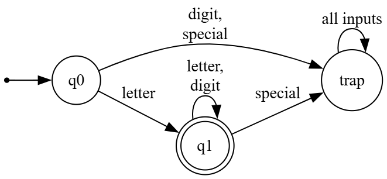
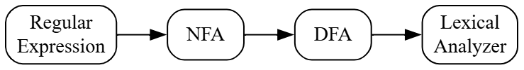
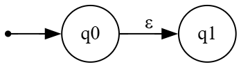
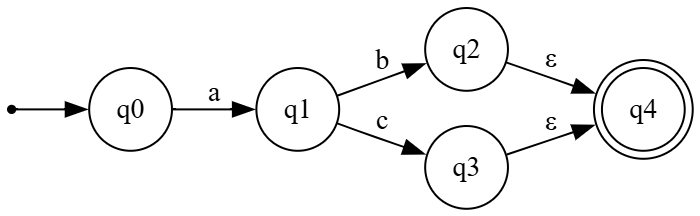
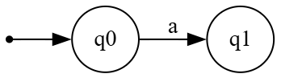
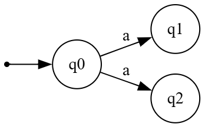
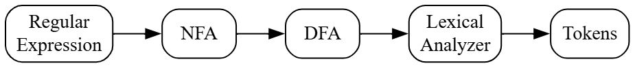

# Principles of Compiler Design
# Lecture 6 - Non-Deterministic Finite Automata (NFA)

**Course:** B.Tech Information Technology (Semester VII)  
**Module:** 1 - Lexical Analysis  
**Lecture Duration:** 60 Minutes

---

# Learning Objectives

After completing this lecture, students should be able to:

- Explain why DFA is not always convenient to construct.
- Define a Non-Deterministic Finite Automaton (NFA).
- Understand multiple transitions and ε-transitions.
- Compare DFA and NFA.
- Explain why NFA is important in compiler construction.

---

# Revision

In the previous lecture, we studied **Deterministic Finite Automata (DFA)**.

We learned that:

- A DFA recognizes patterns.
- It reads one character at a time.
- Every state has exactly one transition for every input symbol.
- DFAs are used inside the Lexical Analyzer.

Consider the following Identifier DFA.

---

## Figure 6.1 : DFA for Identifier



---

# A Question...

If DFA works perfectly,

> **Why do we need another automaton?**

Why was NFA invented?

---

# Motivation

Suppose we want to recognize the following Regular Expression.

```text
(a|b)*abb
```

Now try drawing its DFA.

You will notice that it is **not very easy**.

As the Regular Expression becomes larger,

- the number of states increases,
- transitions become complicated,
- designing the DFA manually becomes difficult.

---

# Think Like a Compiler 💡

Imagine you are constructing a building.

There are two approaches.

### Approach 1

Construct the final building directly.

This is difficult.

---

### Approach 2

First prepare a rough blueprint.

Then refine it.

Finally build the complete structure.

This is much easier.

The compiler follows the second approach.

Instead of constructing a DFA directly,

it first constructs an **NFA**.

Later,

the NFA is automatically converted into an equivalent DFA.

---

## Compiler Pipeline

---

## Figure 6.2 : Regular Expression to Scanner



---

# Important Observation

Notice something interesting.

The compiler **does not execute the NFA**.

Instead,

the NFA is simply an intermediate model.

The compiler eventually converts it into a DFA because

- DFA execution is faster.
- DFA has only one possible transition.
- DFA is ideal for lexical analysis.

Therefore,

NFA is mainly used during **compiler construction**, whereas DFA is used during **compiler execution**.

---

# What is an NFA?

## Definition

A **Non-Deterministic Finite Automaton (NFA)** is a Finite Automaton in which,

for a given state and a given input symbol,

there may be

- no transition,
- one transition, or
- multiple possible transitions.

Unlike a DFA,

an NFA can have **more than one possible path** for the same input.

---

# Why is it called "Non-Deterministic"?

The word **Deterministic** means

> "There is only one possible choice."

The word **Non-Deterministic** means

> "There may be multiple possible choices."

For example,

Suppose the automaton is in state

```text
q0
```

and the input is

```text
a
```

The automaton may move to

```text
q1
```

or

```text
q2
```

Both are valid.

The automaton is free to choose either path.

This property makes it **Non-Deterministic**.

---

# Components of an NFA

Surprisingly,

the components of an NFA are exactly the same as a DFA.

An NFA is represented as

```text
M = (Q, Σ, δ, q₀, F)
```

where

| Symbol | Meaning |
|---------|----------|
| **Q** | Set of States |
| **Σ** | Input Alphabet |
| **δ** | Transition Function |
| **q₀** | Start State |
| **F** | Set of Final States |

---

# What is Different?

Only the **Transition Function (δ)** changes.

In a DFA,

each input symbol has exactly **one** transition.

In an NFA,

each input symbol may have

- zero transitions,
- one transition,
- multiple transitions.

This is the biggest difference between DFA and NFA.

---

# Classroom Discussion

Ask yourself.

Suppose an NFA has two possible paths.

Which path does it choose?

We shall answer this question in the next section.

---

---

# Multiple Transitions in an NFA

The most important feature of an NFA is that it can have **multiple transitions for the same input symbol**.

Let us understand this with an example.

Suppose the automaton is currently in state **q0** and the next input symbol is **a**.

Instead of having only one transition (as in a DFA), the NFA can move to **more than one state**.

---

## Figure 6.3 : Multiple Transitions for the Same Input


---

# What Does This Mean?

Suppose the input string is

```text
a
```

The automaton is currently at **q0**.

After reading **a**, there are **two possible choices**.

```
Choice 1

q0
 │
 ▼
q1
```

or

```
Choice 2

q0
 │
 ▼
q2
```

Unlike a DFA,

the NFA **does not have to choose only one path**.

Conceptually, it explores **all possible paths simultaneously**.

---

# Important Note


> **"How can one machine go in two directions at the same time?"**

The answer is:

It **does not physically split into two machines**.

An NFA is a **mathematical model**, not a real machine.

When we simulate an NFA (or convert it into a DFA), we keep track of **all possible current states**.

---

# Acceptance Rule of an NFA

This is one of the most important concepts.

An NFA accepts the input string if **at least one possible path reaches an accepting state after reading the entire input**.

It is **not necessary** for every path to reach the accepting state.

---

# Example

Suppose there are two paths.

```
Path 1

q0 → q1 → q3 (Accept)

Path 2

q0 → q2 → q4 (Reject)
```

Since **one path reaches the accepting state**, the string is **accepted**.

---

# Think Like a Compiler 💡

Imagine you are solving a maze.

At one junction, there are two roads.

Instead of choosing only one road, imagine you have two friends.

- Friend A explores the left path.
- Friend B explores the right path.

If **any one friend** reaches the destination, the maze is considered solved.

This is exactly how we think about an NFA.

---

# Epsilon (ε) Transition

The second important feature of an NFA is the **ε-transition**.

The Greek letter **ε (epsilon)** represents an **empty string**.

An ε-transition allows the automaton to move from one state to another **without reading any input symbol**.

---

## Figure 6.4 : ε-Transition



---

# What Does an ε-Transition Mean?

Suppose the automaton is in **q0**.

It can immediately move to **q1**.

It does **not** consume any input character.

If the input is

```text
abc
```

the automaton moves

```
q0
 │
 ε
 ▼
q1
```

The input is **still**

```text
abc
```

No character has been read yet.

---

# Real-Life Analogy

Imagine entering a shopping mall.

```
Main Entrance
      │
      ▼
Information Desk
      │
      ▼
Food Court
```

Suppose there is a shortcut.

```
Main Entrance
      │
      ▼
Food Court
```

You moved to another location **without passing through the Information Desk**.

Similarly,

an ε-transition allows the automaton to change its state **without consuming any input symbol**.

---

# Why Are ε-Transitions Useful?

They make it much easier to combine smaller automata.

For example,

suppose we already have:

- an automaton for **a**
- another automaton for **b**

To build an automaton for

```text
a|b
```

we simply connect them using ε-transitions.

This idea is the foundation of **Thompson Construction**, which we will study in the next lecture.

---

# Example of an NFA

Language:

Accept either

```text
ab
```

or

```text
ac
```

---

## Figure 6.5 : NFA for "ab | ac"



---

# Tracing the Input "ab"

| Step | Current State | Input | Next State |
|------|---------------|-------|------------|
| 1 | q0 | a | q1 |
| 2 | q1 | b | q2 |
| 3 | q2 | ε | q4 |

The automaton reaches the accepting state.

Therefore,

**Accepted**

---

# Tracing the Input "ac"

| Step | Current State | Input | Next State |
|------|---------------|-------|------------|
| 1 | q0 | a | q1 |
| 2 | q1 | c | q3 |
| 3 | q3 | ε | q4 |

Again,

the automaton reaches the accepting state.

Therefore,

**Accepted**

---

# Important Observation

Notice that the automaton successfully accepts **two different strings** using the same structure.

This flexibility makes NFAs much easier to design than DFAs for complex patterns.

---

---

# DFA vs NFA

Now that we have studied both DFA and NFA, let us compare them.

Understanding the differences between them is very important because it is a frequently asked university examination question.

---

# Comparison Table

| Feature | DFA | NFA |
|---------|-----|-----|
| Full Form | Deterministic Finite Automaton | Non-Deterministic Finite Automaton |
| Number of transitions for one input | Exactly one | Zero, One, or Many |
| ε-Transitions | Not Allowed | Allowed |
| Next State | Always uniquely determined | Multiple possibilities may exist |
| Execution Speed | Faster | Slower to simulate directly |
| Compiler Usage | Used inside the Lexical Analyzer | Used while constructing the Lexical Analyzer |
| Ease of Construction | Difficult for complex Regular Expressions | Easier to construct from Regular Expressions |

---

# Understanding the Difference

Consider the input symbol

```text
a
```

### DFA

There is only one possible transition.

---

## Figure 6.6 : DFA Transition



### NFA

The same input symbol can lead to multiple states.

---

## Figure 6.7 : NFA Transition



---

# Which One is Better?

> **"If DFA is faster, why don't we always use DFA?"**

This is an excellent question.

The answer is:

It depends on **what we are trying to do**.

### During Compiler Design

The compiler designer starts with **Regular Expressions**.

For complex Regular Expressions, constructing a DFA directly is difficult.

An NFA is much easier to build.

Therefore,

Compiler designers first construct an **NFA**.

---

### During Compiler Execution

Once the NFA is available,

it is automatically converted into an equivalent DFA.

The Lexical Analyzer then executes the DFA because

- only one transition is possible,
- execution is very fast,
- no backtracking is required.

---

# Think Like a Compiler 💡

Imagine you are planning a road trip.

While planning,

you may consider several different routes.

```
Route A

Route B

Route C
```

After comparing them,

you select the **best route**.

While actually driving,

you follow only that one route.

Similarly,

- The **NFA** represents all possible paths while designing.
- The **DFA** is the final optimized path used during execution.

---

# Complete Compiler Flow

This is the complete journey from a Regular Expression to token recognition.

---

## Figure 6.8 : Complete Compiler Flow



---

# Common Student Doubts

## Doubt 1

**Can an NFA have two Start States?**

**Answer:**

No.

Every NFA has only one Start State.

---

## Doubt 2

**Can a DFA contain ε-transitions?**

**Answer:**

No.

ε-transitions are allowed only in an NFA.

---

## Doubt 3

**Can an NFA reject a string even if one path fails?**

**Answer:**

No.

If **at least one path** reaches an accepting state after consuming the complete input, the string is accepted.

---

## Doubt 4

**Does the compiler execute an NFA?**

**Answer:**

Normally, no.

The compiler converts the NFA into an equivalent DFA and executes the DFA because it is faster.

---

# Quick Revision

Remember the following points.

### DFA

- Exactly one transition.
- No ε-transition.
- Fast execution.
- Used inside the Lexical Analyzer.

---

### NFA

- Multiple transitions possible.
- ε-transitions allowed.
- Easier to construct.
- Used during scanner construction.

---

# Viva Questions

1. Define NFA.
2. Why is it called Non-Deterministic?
3. What is an ε-transition?
4. Can an NFA have multiple transitions for the same input?
5. Can a DFA contain ε-transitions?
6. Which automaton is easier to construct?
7. Which automaton is used by the Lexical Analyzer?
8. Why is NFA converted into DFA?
9. What is the biggest difference between DFA and NFA?
10. Can one accepting path make the entire string accepted?

---

# University Questions

- Explain NFA with a suitable example.
- Compare DFA and NFA.
- Explain the role of NFA in Compiler Design.
- Explain NFA with a neat state diagram.
- Compare DFA and NFA in detail with suitable examples.
- Explain why an NFA is converted into a DFA during compiler construction.

---

# Practice Problems

## Problem 1

Draw an NFA that accepts

```text
ab
```

---

## Problem 2

Draw an NFA that accepts

```text
a|b
```

---

## Problem 3

Draw an NFA that accepts

```text
a*
```

---

## Problem 4

Explain why ε-transitions make Thompson Construction easier.

---

# Summary

In this lecture, we learned:

- Why DFA is not always convenient to construct.
- The concept of a Non-Deterministic Finite Automaton (NFA).
- Multiple transitions in an NFA.
- ε-transitions and their purpose.
- Differences between DFA and NFA.
- Why compiler designers first construct an NFA.
- Why the Lexical Analyzer ultimately executes a DFA.

---

# Looking Ahead

In the next lecture, we will study one of the most important topics in Compiler Design:

## **From Regular Expressions to Automata (Thompson Construction)**

We will learn how a compiler systematically converts a Regular Expression into an NFA using simple construction rules for:

- Single symbols
- Concatenation
- Union (`|`)
- Kleene Star (`*`)

This forms the foundation of automatic scanner generation tools.