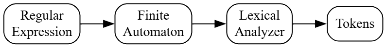
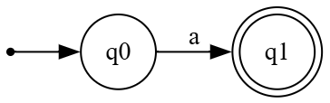
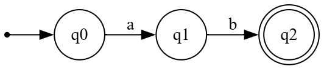
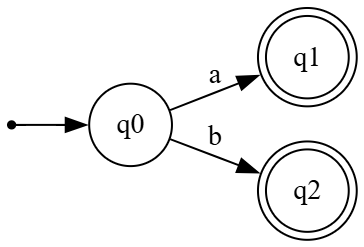
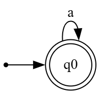
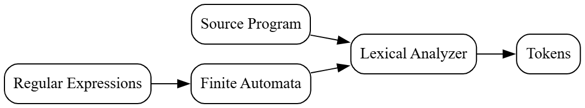

# Principles of Compiler Design
# Lecture 7 - From Regular Expressions to Automata

**Course:** B.Tech Information Technology (Semester VII)  
**Module:** 1 - Lexical Analysis  
**Lecture Duration:** 60 Minutes

---

# Learning Objectives

After completing this lecture, students should be able to:

- Explain why Regular Expressions alone cannot be used for lexical analysis.
- Understand the need for converting Regular Expressions into Finite Automata.
- Explain how a compiler recognizes patterns using automata.
- Draw simple automata for basic Regular Expressions.
- Relate Regular Expressions, Automata, and the Lexical Analyzer.

---

# Revision

In the previous lectures, we studied:

- Regular Expressions
- Deterministic Finite Automata (DFA)
- Non-Deterministic Finite Automata (NFA)

Now let us connect all these concepts.

Ask yourself:

> **How does a compiler use a Regular Expression to recognize tokens?**

The answer is the topic of today's lecture.

---

# The Problem

Suppose we define an Identifier using the following Regular Expression.

```text
letter(letter|digit)*
```

This expression clearly describes the pattern of an Identifier.

But can the compiler execute this Regular Expression directly?

**No.**

A Regular Expression is only a **description of a pattern**.

It is **not an executable machine**.

---

# Think Like a Compiler 💡

Imagine you have a recipe for making tea.

```text
Tea Powder
Sugar
Milk
Water
```

This recipe explains **what** should be done.

But can the recipe prepare tea by itself?

No.

A person is needed to follow the recipe.

Similarly,

A Regular Expression only describes a pattern.

The compiler needs an executable model that can actually recognize strings.

That executable model is a **Finite Automaton**.

---

# Why Convert Regular Expressions into Automata?

A compiler performs lexical analysis by reading the source program **one character at a time**.

Regular Expressions are excellent for **describing patterns**, but they are **not suitable for execution**.

Finite Automata, on the other hand,

- process one character at a time,
- move from one state to another,
- finally decide whether a string matches the required pattern.

Therefore,

the compiler converts every Regular Expression into an Automaton.

---

# Compiler Pipeline

---

## Figure 7.1 : Regular Expression to Token Recognition



---

# Example 1

Consider the Regular Expression

```text
a
```

It matches only one string.

```text
a
```

Accepted

```text
a
```

Rejected

```text
b
ab
aa
```

Now let us build an Automaton for it.

---

## Figure 7.2 : Automaton for Regular Expression "a"



---


# Understanding the Automaton

Initially,

the automaton is in **q0**.

If the input character is

```text
a
```

it moves to **q1**.

Since **q1** is the accepting state,

the input is accepted.

---

# Example 2

Regular Expression

```text
ab
```

Meaning

The string must contain

```text
a
```

followed immediately by

```text
b
```

Accepted

```text
ab
```

Rejected

```text
a
b
abb
ba
aa
```

---

## Figure 7.3 : Automaton for "ab"



---

# Step-by-Step Execution

Input

```text
ab
```

| Character | Current State | Next State |
|-----------|---------------|------------|
| a | q0 | q1 |
| b | q1 | q2 |

The automaton finishes in an accepting state.

Therefore,

**Accepted**

---

# Important Observation

Notice something interesting.

As the Regular Expression becomes larger,

the Automaton also becomes larger.

Fortunately,

the compiler generates these automata automatically.

The programmer does not draw them manually.

---
---

# Regular Expression using Union ( | )

Until now, we have seen Regular Expressions that match only one pattern.

Now let us study the **Union Operator**.

The symbol **|** means **OR**.

For example,

```text
a|b
```

means

> Accept either **a** or **b**.

---

# Accepted Strings

```text
a
b
```

Rejected Strings

```text
ab
ba
aa
bb
```

---

## Figure 7.4 : Automaton for Regular Expression "a|b"



---

# Understanding the Automaton

Initially,

the automaton is in **q0**.

If it reads

```text
a
```

it moves to **q1**.

If it reads

```text
b
```

it moves to **q2**.

Both states are accepting states.

Therefore,

both strings are accepted.

---

# Regular Expression using Kleene Star (*)

The **Kleene Star** means

> Zero or More Occurrences

For example,

```text
a*
```

means

- zero a
- one a
- two a
- three a

and so on.

---

# Accepted Strings

```text
ε
a
aa
aaa
aaaa
```

Rejected Strings

```text
b
ab
ba
```

---

## Figure 7.5 : Automaton for Regular Expression "a*"



---

# Why is q0 an Accepting State?

This is one of the most common doubts.

Remember,

```text
a*
```

accepts

```text
ε
```

which means **zero occurrences of a**.

If the user provides no input,

the automaton remains in **q0**.

Therefore,

the starting state itself must also be an accepting state.

---

# Think Like a Compiler 💡

Suppose a teacher says,

> "You may submit **zero or more** assignments."

Possible submissions are

```text
0 Assignments

1 Assignment

2 Assignments

10 Assignments
```

All are allowed.

This is exactly the meaning of

```text
*
```

in a Regular Expression.

---

# Practical Compiler Example

Consider the following identifier.

```c
result123
```

The lexical analyzer uses the Regular Expression

```text
letter(letter|digit)*
```

This means

- first character must be a letter
- remaining characters can be letters or digits

Instead of checking this rule manually,

the compiler converts the Regular Expression into an Automaton.

Then,

it processes

```text
r
↓

e
↓

s
↓

u
↓

l
↓

t
↓

1
↓

2
↓

3
```

Each character moves the automaton from one state to another.

Finally,

the compiler recognizes

```text
<ID, result123>
```

---

# Another Practical Example

Suppose the compiler reads

```c
int
```

It checks whether the word satisfies the identifier pattern.

Yes,

it does.

But then,

the compiler consults its **Keyword Table**.

Since

```text
int
```

already exists as a reserved keyword,

it generates

```text
<KEYWORD, int>
```

instead of

```text
<ID, int>
```

---

# Where are Regular Expressions Used?

Compilers commonly use Regular Expressions to describe:

| Token | Example Regular Expression |
|--------|----------------------------|
| Identifier | `letter(letter|digit)*` |
| Integer | `digit+` |
| Floating Point Number | `digit+\.digit+` |
| Whitespace | `(blank|tab|newline)+` |
| Operator | `+`, `-`, `*`, `/` |
| Delimiters | `(` `)` `{` `}` `;` |

The compiler converts each of these patterns into an Automaton.

---

# Important Observation

A programmer writes

```text
Regular Expression
```

The compiler internally creates

```text
Finite Automaton
```

The compiler executes

```text
Finite Automaton
```

—not the Regular Expression itself.

This is the key idea of today's lecture.

---

---

# From Regular Expressions to Token Recognition

Let us now connect all the concepts that we have learned so far.

When a programmer writes a source program, the compiler does **not** directly recognize keywords, identifiers, operators, or constants.

Instead, it follows a systematic process.

---

## Figure 7.6 : Complete Token Recognition Process



---

# How the Compiler Recognizes an Identifier

Consider the following statement.

```c
totalMarks = marks1 + marks2;
```

The lexical analyzer reads the program **one character at a time**.

For the word

```text
totalMarks
```

the compiler checks whether it matches the Regular Expression

```text
letter(letter|digit)*
```

Since it matches,

the corresponding automaton reaches an accepting state.

The lexical analyzer generates the token

```text
<ID, totalMarks>
```

Similarly,

```text
=
```

becomes

```text
<ASSIGN, =>
```

```text
+
```

becomes

```text
<PLUS, +>
```

and

```text
;
```

becomes

```text
<SEMICOLON, ;>
```

---

# Think Like a Compiler 💡

Imagine you are a librarian.

A student gives you a book.

You don't read the entire book.

Instead, you check:

- Is it a science book?
- Is it a mathematics book?
- Is it a history book?

You compare it with predefined categories.

Similarly,

the compiler compares every sequence of characters with predefined Regular Expressions.

If a match is found,

the corresponding token is generated.

---

# Common Student Mistakes

## Mistake 1

❌ Regular Expressions are executed by the compiler.

✅ Regular Expressions only **describe** token patterns.

The compiler executes the corresponding Automata.

---

## Mistake 2

❌ One Regular Expression is enough for an entire program.

✅ Every token type has its own Regular Expression.

Examples:

- Identifier
- Integer
- Floating Point Number
- Operator
- Keyword
- Delimiter

---

## Mistake 3

❌ Automata understand programming languages.

✅ Automata recognize **patterns of characters**.

Understanding the grammar of the language is the responsibility of the **Parser**, not the Lexical Analyzer.

---

# Exam Alert ⚠️

Remember the following points.

### Regular Expression

- Describes a pattern.
- Easy for humans to write.
- Used during scanner design.

---

### Automaton

- Recognizes the pattern.
- Executed by the compiler.
- Used during lexical analysis.

---

# Quick Revision

```text
Regular Expression
        │
        ▼
Finite Automaton
        │
        ▼
Lexical Analyzer
        │
        ▼
Tokens
        │
        ▼
Syntax Analyzer
```

This complete flow is one of the most important concepts in Module 1.

---

# Activity

Write the following Regular Expressions on the board.

```text
a

ab

a|b

a*

letter(letter|digit)*
```

Students to identify:

- What strings are accepted?
- What strings are rejected?

---

# University Questions

- Explain the conversion of Regular Expressions into Automata.
- Explain the role of Regular Expressions in Compiler Design.
- Explain how the Lexical Analyzer recognizes tokens.
- Explain the concept of converting Regular Expressions into Automata with suitable examples.
- Explain the complete process of token recognition using Regular Expressions and Automata.

---

# Summary of Module 1

We have now completed the following topics:

- Introduction to Compiler
- Phases of Compiler
- Grouping of Compiler Phases
- Lexical Analysis
- Role of the Lexical Analyzer
- Input Buffering
- Recognition of Tokens
- Regular Expressions
- Deterministic Finite Automata (DFA)
- Non-Deterministic Finite Automata (NFA)
- From Regular Expressions to Automata

Only one topic remains in Module 1:

> **The Lexical-Analyzer Generator (LEX)**

---

# Looking Ahead

In the next lecture, we will study:

## LEX (Lexical-Analyzer Generator)

Topics include:

- What is LEX?
- Why was LEX developed?
- Structure of a LEX specification
- How LEX generates a Lexical Analyzer
- Advantages and limitations of LEX

This will complete **Module 1**.

---

# End of Lecture 7

> **Key Takeaway:** A Regular Expression describes a pattern, while a Finite Automaton recognizes that pattern. The compiler bridges these two concepts to perform efficient lexical analysis.