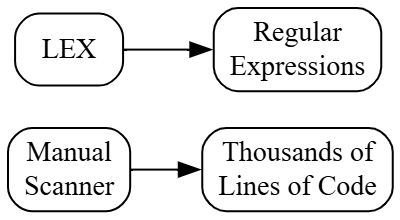
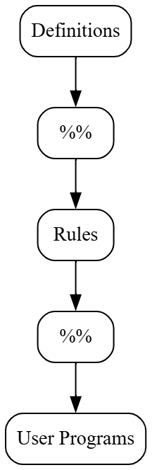
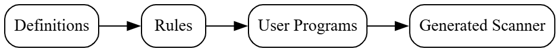
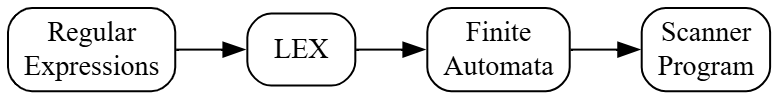
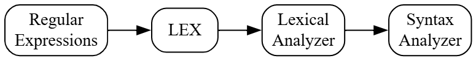

# Principles of Compiler Design
# Lecture 8 - The Lexical Analyzer Generator (LEX)

**Course:** B.Tech Information Technology (Semester VII)  
**Module:** 1 - Lexical Analysis  
**Lecture Duration:** 60 Minutes

---

# Learning Objectives

After completing this lecture, students should be able to:

- Explain what LEX is.
- Explain why LEX was developed.
- Understand the need for an automatic scanner generator.
- Explain how LEX fits into the compiler design process.
- Differentiate between a manually written lexical analyzer and one generated using LEX.

---

# Revision

So far we have studied:

- Compiler Phases
- Lexical Analysis
- Tokens
- Lexemes
- Patterns
- Input Buffering
- Regular Expressions
- DFA
- NFA
- Regular Expression → Automata

Now a new question arises.

> **Who converts these Regular Expressions into an actual Lexical Analyzer?**

The answer is:

> **LEX**

---

# Motivation

Suppose you are developing a compiler for a new programming language.

The language contains

- Keywords
- Identifiers
- Numbers
- Operators
- Delimiters
- Comments
- White Spaces

Every one of these requires a pattern.

For example,

| Token | Pattern |
|--------|---------|
| Identifier | `letter(letter|digit)*` |
| Integer | `digit+` |
| Floating Point | `digit+\.digit+` |
| Operator | `+`, `-`, `*`, `/` |
| Delimiter | `(` `)` `{` `}` `;` |

Can we write C code to recognize every one of these manually?

Yes.

But imagine a programming language having hundreds of token types.

Writing and maintaining such a scanner becomes very difficult.

---

# The Need for LEX

Instead of writing thousands of lines of scanner code manually,

what if we simply describe

**"What patterns should be recognized?"**

and let a tool automatically generate the scanner?

That is exactly what **LEX** does.

---

# What is LEX?

**LEX** is a software tool that automatically generates a **Lexical Analyzer (Scanner)** from a set of **Regular Expressions**.

Instead of writing scanner logic manually,

the programmer only specifies the patterns to be recognized.

LEX generates the scanner automatically.

---

# Definition

> **LEX is a Lexical Analyzer Generator that converts token patterns (written as Regular Expressions) into a scanner program capable of recognizing those tokens.**

---

# Think Like a Compiler 💡

Imagine you want to build a house.

There are two approaches.

### Approach 1

Build every brick manually.

This takes time.

---

### Approach 2

Give the architect a blueprint.

The architect prepares the complete construction plan.

Much easier.

Similarly,

Instead of writing scanner code manually,

we provide token specifications to LEX.

LEX generates the scanner automatically.

---

# Manual Scanner vs LEX

| Manual Scanner | Using LEX |
|----------------|-----------|
| Programmer writes complete scanner logic | Programmer writes only token patterns |
| Large amount of code | Very little code |
| Difficult to debug | Easy to maintain |
| More chances of errors | Fewer errors |
| Time consuming | Faster development |

---

# Inside the Compiler 🔍

Without LEX

```text
Programmer

        │

Writes thousands of lines
of scanner code

        │

Compiler
```

With LEX

```text
Programmer

        │

Writes Regular Expressions

        │

LEX

        │

Generates Scanner

        │

Compiler
```

Notice the difference.

The programmer now focuses on **describing the language**, not on implementing every character check manually.

---

## Figure 8.1 : Manual Scanner vs LEX



---

# How Does LEX Help?

Suppose the programmer specifies the following rule.

```text
Identifier

↓

letter(letter|digit)*
```

LEX automatically generates code that recognizes

```text
student

sum1

totalMarks

result123
```

without the programmer writing the scanner manually.

---

# Important Observation

Remember,

LEX **does not invent the token patterns**.

The programmer must still define them using **Regular Expressions**.

LEX simply converts those specifications into a working scanner.

---

# Classroom Discussion

> **Can LEX recognize a programming language without any token definitions?**

answer:

**No.**

LEX requires token specifications from the programmer.

It only automates the implementation of the scanner.

---

# Summary

In this part, we learned:

- Why LEX was developed.
- What problems it solves.
- Definition of LEX.
- Manual scanner vs automatically generated scanner.
- Role of LEX in compiler construction.

---

---

# Structure of a LEX Program

A LEX program is divided into **three sections**.

Every LEX specification follows the same basic structure.

```text
Definitions
%%
Rules
%%
User Programs
```

The symbol

```text
%%
```

acts as a separator between the sections.

---

## Figure 8.2 : Structure of a LEX Program



---


# Section 1 - Definitions

The **Definitions Section** contains information that will be used later in the Rules section.

Typical contents include:

- Named Regular Expressions
- Constants
- Header Files
- Variable Declarations

Think of this section as **preparation**.

It does not recognize tokens.

Instead,

it defines the building blocks that will be used later.

---

# Real-Life Analogy

Imagine a chef preparing ingredients.

Before cooking,

the chef keeps ready

- vegetables
- spices
- oil
- utensils

Actual cooking has not yet started.

Similarly,

the Definitions section prepares everything required before token recognition begins.

---

# Section 2 - Rules

This is the **heart of a LEX program**.

Here,

each Regular Expression is associated with an action.

Conceptually,

the Rules section says

> "If this pattern is found, perform this action."

For example,

```
Pattern

↓

Action
```

Examples of actions include

- Return a token.
- Ignore white spaces.
- Count line numbers.
- Display a message.

---

# Think Like a Compiler 💡

Imagine a security guard.

He follows simple rules.

```
If Employee Card

↓

Allow Entry

If Visitor Card

↓

Issue Visitor Pass

If No Card

↓

Stop Entry
```

Similarly,

LEX follows

```
If Pattern Matches

↓

Perform Action
```

---

# Section 3 - User Programs

The final section contains supporting program code.

Typical contents include

- Additional functions
- Helper routines
- Main program (if required)
- Error handling routines

These are ordinary programming functions that assist the generated scanner.

---

# Complete Flow of a LEX Program

---

## Figure 8.3 : Internal Organization of LEX



---

# How LEX Works Internally

Although the programmer writes only Regular Expressions,

LEX performs several operations internally.

The overall process is shown below.

---

## Figure 8.4 : Working of LEX



---

# Step-by-Step Explanation

### Step 1

The programmer writes token patterns using **Regular Expressions**.

Example

```text
Identifier

Number

Operator

Keyword
```

---

### Step 2

These specifications are given to LEX.

LEX analyzes all the Regular Expressions.

---

### Step 3

Internally,

LEX constructs Finite Automata for those patterns.

This is why we studied

- DFA
- NFA
- Regular Expressions

before learning LEX.

---

### Step 4

LEX automatically generates a scanner program.

The programmer does not write scanner logic manually.

---

# Inside the Compiler 🔍

The complete process looks like this.

```text
Token Specifications

        │

Regular Expressions

        │

LEX

        │

Finite Automata

        │

Generated Scanner

        │

Compiler
```

Notice that

**LEX is a bridge between token specifications and the actual scanner.**

---

# Important Observation

Students often think

> "LEX itself is the Lexical Analyzer."

This is **not correct**.

LEX is **a tool that generates a Lexical Analyzer**.

Once generation is complete,

the generated scanner performs lexical analysis.

---

# Common Student Doubts

## Doubt 1

**Is LEX a compiler?**

No.

LEX is only a **scanner generator**.

---

## Doubt 2

**Does LEX check syntax?**

No.

Syntax checking is performed by the **Parser**.

LEX only performs **Lexical Analysis**.

---

## Doubt 3

**Can LEX generate machine code?**

No.

LEX only generates a scanner program.

---

# Summary

In this part, we learned:

- Three sections of a LEX program.
- Purpose of each section.
- Internal working of LEX.
- How LEX generates a scanner.
- Difference between LEX and the generated Lexical Analyzer.

---

---

# Advantages of LEX

LEX became popular because it simplifies the development of lexical analyzers.

Some important advantages are:

### 1. Faster Development

The programmer only writes token patterns.

LEX automatically generates the scanner.

---

### 2. Less Programming Effort

Instead of writing hundreds of lines of scanner code,

only a small LEX specification is required.

---

### 3. Easy Maintenance

If the programming language changes,

only the token specifications need to be modified.

LEX generates a new scanner automatically.

---

### 4. Fewer Errors

Since scanner code is automatically generated,

the possibility of programming mistakes is greatly reduced.

---

### 5. Standardized Scanner

LEX follows a systematic approach for generating lexical analyzers.

This makes scanner development more reliable and consistent.

---

# Limitations of LEX

Although LEX is a powerful tool,

it also has some limitations.

### 1. Limited to Lexical Analysis

LEX only recognizes tokens.

It cannot check grammatical correctness.

---

### 2. Cannot Parse Statements

For example,

LEX can recognize

```c
if
```

and

```c
(
```

and

```c
x
```

but it cannot determine whether the complete

```c
if (x > 0)
```

statement follows the grammar of the language.

That responsibility belongs to the **Parser**.

---

### 3. Depends on Regular Expressions

LEX works only for patterns that can be expressed using Regular Expressions.

More complex language constructs require parsing techniques.

---

# LEX in the Complete Compiler

Let us now see where LEX fits in the compiler.

---

## Figure 8.5 : LEX in the Compiler Pipeline



---

# Inside the Compiler 🔍

The complete process from source code to tokens is now clear.

```text
Programmer

        │

Writes Token Patterns

        │

Regular Expressions

        │

LEX

        │

Generates Scanner

        │

Lexical Analyzer

        │

Reads Source Program

        │

Produces Tokens

        │

Parser
```

This is the complete role of LEX in compiler construction.

---

# Common Student Mistakes

## Mistake 1

❌ LEX is a compiler.

✅ LEX is only a **Lexical Analyzer Generator**.

---

## Mistake 2

❌ LEX checks syntax.

✅ Syntax checking is performed by the **Parser**.

---

## Mistake 3

❌ LEX generates machine code.

✅ LEX generates only the scanner.

---

## Mistake 4

❌ Regular Expressions are executed directly.

✅ LEX converts Regular Expressions into a scanner that recognizes those patterns.

---

# Module 1 - At a Glance

```text
                 COMPILER

                     │

                     ▼

          Lexical Analysis

                     │

                     ▼

     Input Characters from Source Program

                     │

                     ▼

        Input Buffering Technique

                     │

                     ▼

          Recognition of Tokens

                     │

                     ▼

        Regular Expressions describe patterns

                     │

                     ▼

        Finite Automata recognize patterns

                     │

                     ▼

      LEX generates the Lexical Analyzer

                     │

                     ▼

          Tokens sent to the Parser
```

---

# One-Page Revision

| Topic | Key Idea |
|--------|----------|
| Compiler | Converts source code into target code |
| Lexical Analyzer | First phase of compiler |
| Token | Smallest meaningful unit |
| Lexeme | Actual sequence of characters |
| Pattern | Rule describing a token |
| Input Buffering | Efficient character reading |
| Regular Expression | Describes token patterns |
| DFA | Deterministic pattern recognizer |
| NFA | Easier to construct from regular expressions |
| LEX | Generates a lexical analyzer automatically |

---

# University Questions

- Explain the structure of a LEX program.
- Explain the working of LEX.
- State the advantages and limitations of LEX.
- Explain the Lexical Analyzer Generator (LEX) with a neat diagram.
- Explain the structure and working of LEX.
- Discuss the role of LEX in compiler design.

---

# End of Module 1

The topics covered are:

- Introduction to Compiler
- Phases of Compiler
- Grouping of Compiler Phases
- Lexical Analysis
- Input Buffering
- Recognition of Tokens
- Regular Expressions
- Finite Automata
- DFA
- NFA
- Regular Expressions to Automata
- LEX

These concepts form the foundation of the remaining compiler phases.

---

# Final Takeaway

> **A Regular Expression describes a token.  
> A Finite Automaton recognizes the token.  
> LEX converts those descriptions into a working Lexical Analyzer.**
